# Raport z laboratorium Hibernate/JPA

### Autorzy:

Filip Węgrzyn  
Seweryn Tasior

## Zadanie 0

```java
public static void main(String[] args) {
    sessionFactory = getSessionFactory();
    Session session = sessionFactory.openSession();
    Product product = new Product("Chipsy Lays Przyprawa Kurczak", 420);
    Transaction tx = session.beginTransaction();
    session.persist(product);
    tx.commit();
    session.close();
    }
```

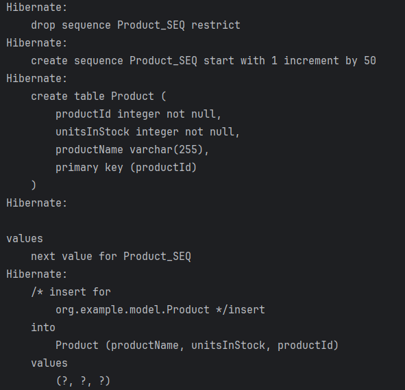
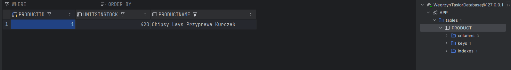

## Zadanie 1

```java
@Entity
public class Product {
    @Id
    @GeneratedValue(strategy = GenerationType.AUTO)
    private Long productId;
    private String productName;
    private int unitsInStock;
    @ManyToOne
    @JoinColumn(name = "supplier_id")
    private Supplier supplier;

    public Product(String productName, int unitsInStock) {
        this.productName = productName;
        this.unitsInStock = unitsInStock;
    }

    public Product() {
    }

    public Supplier getSupplier() {
        return supplier;
    }

    public void setSupplier(Supplier supplier) {
        this.supplier = supplier;
    }
```

```java
@Entity
public class Supplier {
    @Id
    @GeneratedValue(strategy = GenerationType.AUTO)
    private Long supplierId;
    private String companyName;
    private String city;
    private String street;


    public Supplier() {
    }

    public Supplier(String companyName, String city, String street) {
        this.companyName = companyName;
        this.city = city;
        this.street = street;
    }
}
```

```java
public static void main(String[] args) {
    sessionFactory = getSessionFactory();
    Session session = sessionFactory.openSession();

    Transaction tx = session.beginTransaction();

    Product product = session.get(Product.class, 1);
    Supplier supplier = new Supplier("S1", "Krakow", "Piastowska");
    product.setSupplier(supplier);

    session.persist(supplier);
    session.persist(product);
    tx.commit();
    session.close();
}}
```

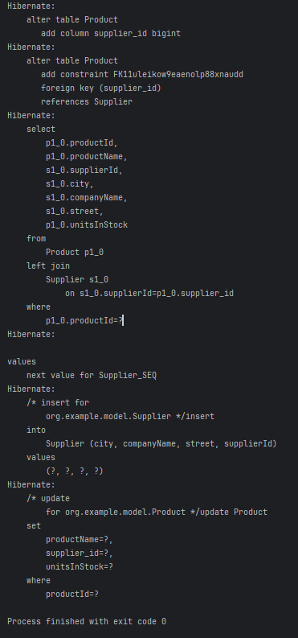
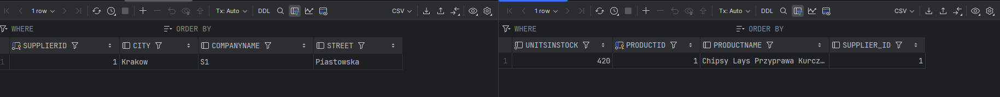

## Zadanie 2

### Zadanie 2a

```java
@Entity
public class Product {
    @Id @GeneratedValue(strategy = GenerationType.AUTO)
    private Long productId;
    private String productName;
    private int unitsInStock;

    public Product(String productName, int unitsInStock) {
        this.productName = productName;
        this.unitsInStock = unitsInStock;
    }

    public Product() {
    }
}
```

```java
@Entity
public class Supplier {
    @Id @GeneratedValue(strategy = GenerationType.AUTO)
    private Long supplierId;
    private String companyName;
    private String city;
    private String street;
    @OneToMany(cascade = CascadeType.ALL)
    @JoinColumn(name = "supplier_id")
    private List<Product> supplies = new ArrayList<>();

    public Supplier() {}

    public Supplier(String companyName, String city, String street) {
        this.companyName = companyName;
        this.city = city;
        this.street = street;
    }

    public List<Product> getSupplies() {
        return supplies;
    }
}
```

```java
public static void main(String[] args) {
    sessionFactory = getSessionFactory();
    Session session = sessionFactory.openSession();
    Transaction tx = session.beginTransaction();

    Supplier s = new Supplier("S2", "Warszawa", "Długa");

    Product p1 = new Product("Pepsi", 100);
    Product p2 = new Product("Lays", 50);

    s.getSupplies().add(p1);
    s.getSupplies().add(p2);

    session.persist(s);
    tx.commit();
    session.close();
}
```


### Zadanie 2b

```java
@Entity
public class Supplier {
    @Id
    @GeneratedValue
    private Long supplierId;
    private String companyName;
    private String city;
    private String street;

    @ManyToMany(cascade = CascadeType.ALL)
    @JoinTable(
            name = "supplier_products",
            joinColumns = @JoinColumn(name = "supplier_id"),
            inverseJoinColumns = @JoinColumn(name = "product_id")
    )
    private List<Product> supplies = new ArrayList<>();

    public Supplier() {
    }

    public Supplier(String companyName, String city, String street) {
        this.companyName = companyName;
        this.city = city;
        this.street = street;
    }

    public List<Product> getSupplies() {
        return supplies;
    }
}
```

```java
public static void main(String[] args) {
    sessionFactory = getSessionFactory();
    Session session = sessionFactory.openSession();
    Transaction tx = session.beginTransaction();

    Supplier s = new Supplier("Nestle", "Krakow", "Pawia");

    Product p1 = new Product("Lion", 30);
    Product p2 = new Product("KitKat", 70);

    s.getSupplies().add(p1);
    s.getSupplies().add(p2);

    session.persist(s);
    tx.commit();
    session.close();
}
```

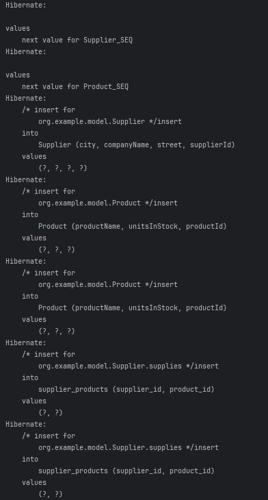
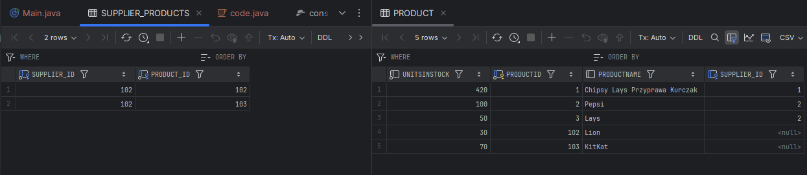

## Zadanie 3

```java
@Entity
public class Supplier {
    @Id @GeneratedValue(strategy = GenerationType.AUTO)
    private Long supplierId;
    private String companyName;
    private String city;
    private String street;
    @OneToMany(mappedBy = "supplier", cascade = CascadeType.ALL, orphanRemoval = true)
    private List<Product> products = new ArrayList<>();

    public Supplier() {}

    public Supplier(String companyName, String city, String street) {
        this.companyName = companyName;
        this.city = city;
        this.street = street;
    }

    public List<Product> getProducts() {
        return products;
    }
}
```

```java
public static void main(String[] args) {
    sessionFactory = getSessionFactory();
    Session session = sessionFactory.openSession();
    Transaction tx = session.beginTransaction();

    Supplier supplier = new Supplier("Nestlé", "Warszawa", "Miodowa 5");

    Product p1 = new Product("Baton Lion", 100);
    Product p2 = new Product("Woda Nałęczowianka", 250);

    supplier.getProducts().add(p1);
    supplier.getProducts().add(p2);
    p1.setSupplier(supplier);
    p2.setSupplier(supplier);

    session.persist(supplier);

    tx.commit();
    session.close();
}
```

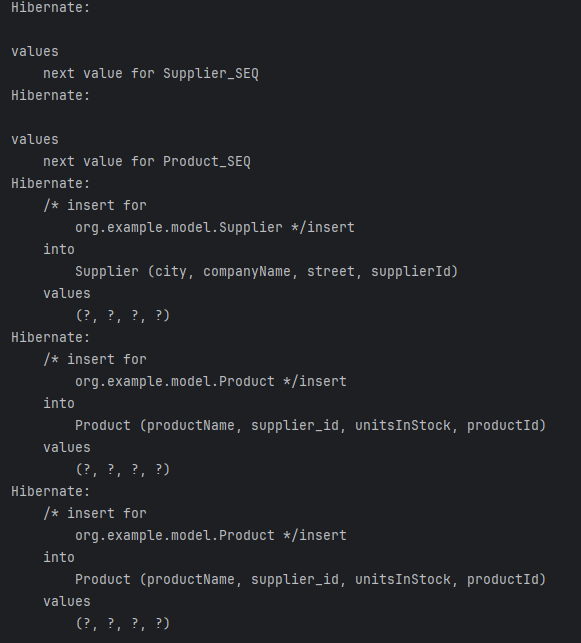
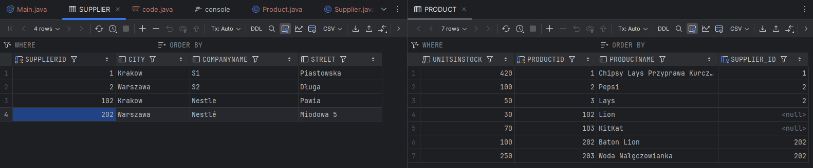

## Zadanie 4

```java
@Entity
public class Category {
    @Id @GeneratedValue(strategy = GenerationType.IDENTITY)
    private Long categoryId;
    private String name;
    @OneToMany(mappedBy = "category", cascade = CascadeType.ALL)
    private List<Product> products = new ArrayList<>();

    public List<Product> getProducts() {
        return products;
    }
}
```

```java
@Entity
public class Product {
    @Id
    @GeneratedValue(strategy = GenerationType.AUTO)
    private Long productId;
    private String productName;
    private int unitsInStock;
    @ManyToOne
    @JoinColumn(name = "supplier_id")
    private Supplier supplier;
    @ManyToOne
    @JoinColumn(name = "category_id")
    private Category category;

    public Product(String productName, int unitsInStock) {
        this.productName = productName;
        this.unitsInStock = unitsInStock;
    }

    public Product() {
    }

    public void setSupplier(Supplier supplier) {
        this.supplier = supplier;
    }

    public void setCategory(Category category) {
        this.category = category;
    }
}
```

```java
public static void main(String[] args) {
    sessionFactory = getSessionFactory();
    Session session = sessionFactory.openSession();
    Transaction tx = session.beginTransaction();

    Category drinks = new Category("Napoje");
    Category snacks = new Category("Przekąski");

    Product cola = new Product("Coca-Cola", 100);
    Product fanta = new Product("Fanta", 80);
    Product lays = new Product("Lays Paprykowe", 120);

    drinks.getProducts().add(cola);
    drinks.getProducts().add(fanta);
    snacks.getProducts().add(lays);
    cola.setCategory(drinks);
    fanta.setCategory(drinks);
    lays.setCategory(snacks);

    session.persist(drinks);
    session.persist(snacks);

    tx.commit();
    session.close();

    Category loadedCategory = session.get(Category.class, 1);
    for (Product p : loadedCategory.getProducts()) {
        System.out.println(p.getProductName());
    }

    Product p = session.get(Product.class, 1L);
    System.out.println("Kategoria: " + p.getCategory().getName());
}
```

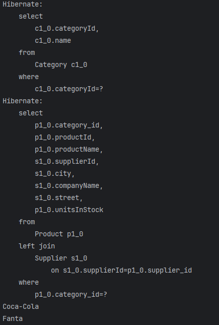
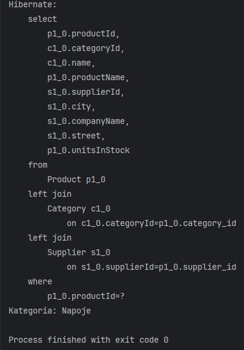
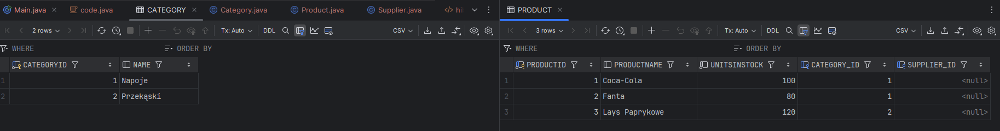

## Zadanie 5

```java
@Entity
public class Invoice {
    @Id @GeneratedValue(strategy = GenerationType.IDENTITY)
    private Long invoiceId;
    @OneToMany(mappedBy = "invoice", cascade = CascadeType.ALL, orphanRemoval = true)
    private List<InvoiceItem> items = new ArrayList<>();

    public List<InvoiceItem> getItems() {
        return items;
    }
}
```

```java
@Entity
public class InvoiceItem {
    @Id
    @GeneratedValue(strategy = GenerationType.IDENTITY)
    private Long id;

    @ManyToOne
    private Invoice invoice;

    @ManyToOne(cascade = CascadeType.PERSIST)
    @JoinColumn(name = "product_id")
    private Product product;

    private int quantity;
}
```

```java
@Entity
public class Product {
    @Id @GeneratedValue(strategy = GenerationType.IDENTITY)
    private Long productId;
    private String productName;
    private int unitsInStock;
    @ManyToOne
    @JoinColumn(name = "supplier_id")
    private Supplier supplier;
    @ManyToOne
    @JoinColumn(name = "category_id")
    private Category category;
    @OneToMany(mappedBy = "product")
    private List<InvoiceItem> invoiceItems = new ArrayList<>();


    public Product(String productName, int unitsInStock) {
        this.productName = productName;
        this.unitsInStock = unitsInStock;
    }

    public Product() {
    }
}
```

```java
public static void main(String[] args) {
    sessionFactory = getSessionFactory();
    Session session = sessionFactory.openSession();
    Transaction tx = session.beginTransaction();

    Product p1 = new Product();
    p1.setProductName("Monitor");
    p1.setUnitsInStock(10);

    Product p2 = new Product();
    p2.setProductName("Myszka");
    p2.setUnitsInStock(30);

    session.persist(p1);
    session.persist(p2);

    //Tworzenie faktury z pozycjami
    Invoice invoice1 = new Invoice();

    InvoiceItem item1 = new InvoiceItem();
    item1.setProduct(p1);
    item1.setInvoice(invoice1);
    item1.setQuantity(2);

    InvoiceItem item2 = new InvoiceItem();
    item2.setProduct(p2);
    item2.setInvoice(invoice1);
    item2.setQuantity(1);

    invoice1.getItems().add(item1);
    invoice1.getItems().add(item2);

    session.persist(invoice1);

    // Druga faktura
    Invoice invoice2 = new Invoice();

    InvoiceItem item3 = new InvoiceItem();
    item3.setProduct(p1);
    item3.setInvoice(invoice2);
    item3.setQuantity(1);

    invoice2.getItems().add(item3);

    session.persist(invoice2);

    tx.commit();
    session.close();
}
```

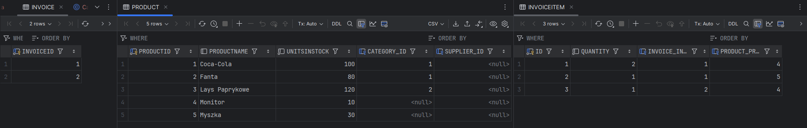

## Zadanie 6

```java
emf = Persistence.createEntityManagerFactory("my-persistence-unit");
EntityManager em = emf.createEntityManager();

EntityTransaction tx = em.getTransaction();
tx.begin();

// reszta kodu bez zmian
// ...


tx.commit();
em.close();
emf.close();
```

## Zadanie 7

```java
@ManyToOne(cascade = CascadeType.PERSIST)
@JoinColumn(name = "product_id")
private Product product;

@OneToMany(mappedBy = "invoice", cascade = CascadeType.ALL, orphanRemoval = true)
private List<InvoiceItem> items = new ArrayList<>();
```

## Zadanie 8

### Zadanie 8a

```java
@Entity
public class Supplier {
    @Id
    @GeneratedValue(strategy = GenerationType.IDENTITY)
    private Long supplierId;
    private String companyName;
    @Embedded
    private Address address;
    @OneToMany(mappedBy = "supplier", cascade = CascadeType.ALL, orphanRemoval = true)
    private List<Product> products = new ArrayList<>();
}
```

```java
@Embeddable
public class Address {
    private Long id;
    private String street;
    private String city;

    public Address() {
    }

    public Address(String street, String city, String postalCode, String country) {
        this.street = street;
        this.city = city;
    }
}
```

### Zadanie 8b

```java
@Entity
public class Supplier {
    @Id
    @GeneratedValue(strategy = GenerationType.IDENTITY)
    private Long supplierId;
    private String companyName;
    @OneToOne(cascade = CascadeType.ALL)
    @JoinColumn(name = "address_id")
    private Address address;
    @OneToMany(mappedBy = "supplier", cascade = CascadeType.ALL, orphanRemoval = true)
    private List<Product> products = new ArrayList<>();
}
```

```java
@Entity
public class Address {
    @Id
    @GeneratedValue(strategy = GenerationType.IDENTITY)
    private Long id;

    private String street;
    private String city;
}
```

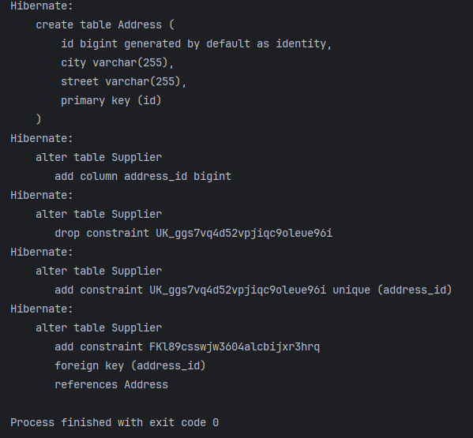

## Zadanie 9

### Single table

```java
@Entity
@Inheritance(strategy = InheritanceType.SINGLE_TABLE)
@DiscriminatorColumn(name = "company_type")
public class Company {
    @Id @GeneratedValue(strategy = GenerationType.AUTO)
    private Long companyId;
    private String companyName;
    private String street;
    private String city;
    private String zipCode;

    public Company() {}

    public Company(String companyName, String street, String city, String zipCode) {
        this.companyName = companyName;
        this.street = street;
        this.city = city;
        this.zipCode = zipCode;
    }
}
```

```java
@Entity
@DiscriminatorValue("CUSTOMER")
public class Customer extends Company{
    private double discount;

    public Customer(double discount, String companyName, String street, String city, String zipCode) {
        super(companyName, street, city, zipCode);
        this.discount = discount;
    }
    public Customer() {}

}
```

```java
@Entity
@DiscriminatorValue("SUPPLIER")
public class Supplier extends Company {
    private String accountNumber;

    public Supplier() {}

    public Supplier(String accountNumber, String companyName, String street, String city, String zipCode) {
        super(companyName, street, city, zipCode);
        this.accountNumber = accountNumber;
    }
}
```

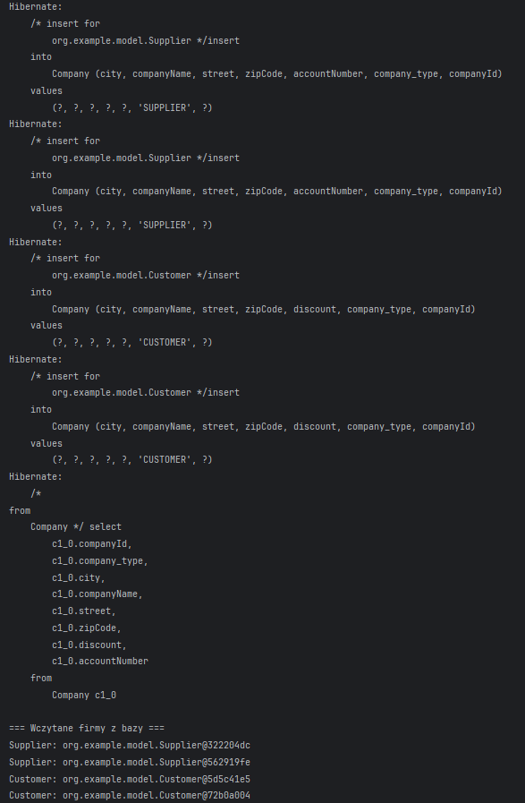

### Table per class

```java
@Entity
@Inheritance(strategy = InheritanceType.TABLE_PER_CLASS)
public class Company

@Entity
public class Customer extends Company

@Entity
public class Supplier extends Company
```

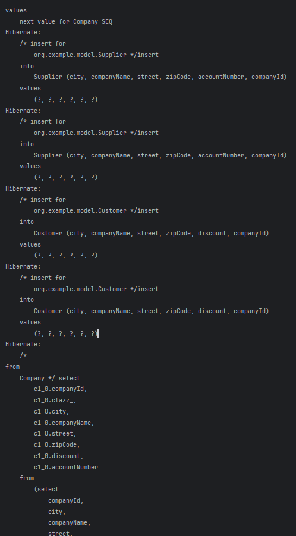
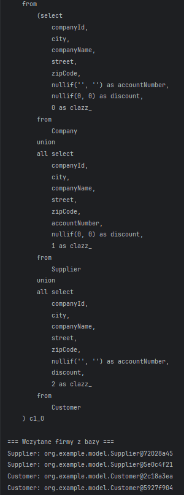

### Joined

```java
@Entity
@Inheritance(strategy = InheritanceType.JOINED)
public class Company
```

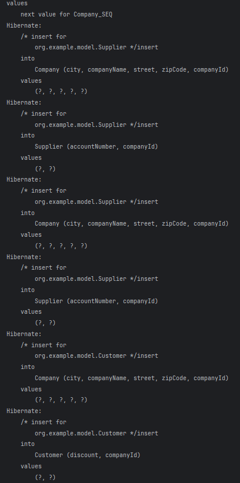
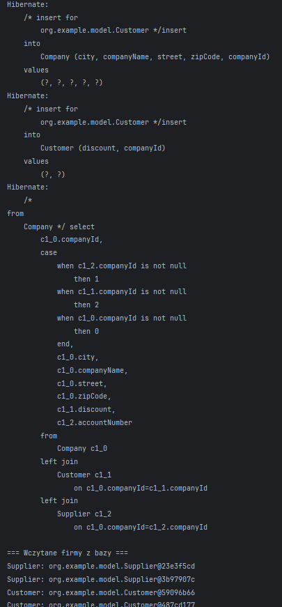

### Main class

```java
public static void main(String[] args) {
    sessionFactory = getSessionFactory();
    Session session = sessionFactory.openSession();

    Transaction tx = session.beginTransaction();

    Supplier supplier1 = new Supplier("ACC123", "Tech Supplies", "First St", "CityA", "12345");
    Supplier supplier2 = new Supplier("ACC124", "Build Co", "Second St", "CityB", "23456");

    Customer customer1 = new Customer(10.5, "Happy Buyer", "Third St", "CityC", "34567");
    Customer customer2 = new Customer(7.0, "Budget Buyer", "Fourth St", "CityD", "45678");

    session.persist(supplier1);
    session.persist(supplier2);
    session.persist(customer1);
    session.persist(customer2);

    tx.commit();

    List<Company> companies = session.createQuery("from Company", Company.class).list();

    System.out.println("\n=== Wczytane firmy z bazy ===");
    companies.forEach(company -> {
        System.out.println(company.getClass().getSimpleName() + ": " + company);
    });

    session.close();
}
```
