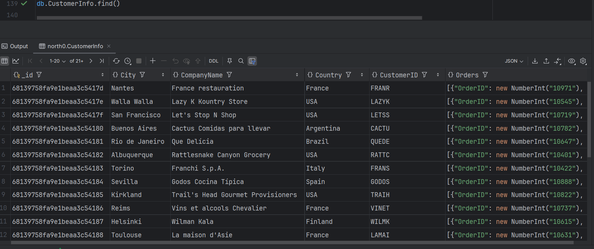
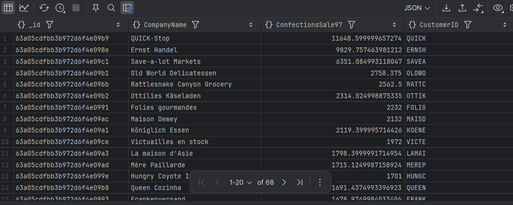
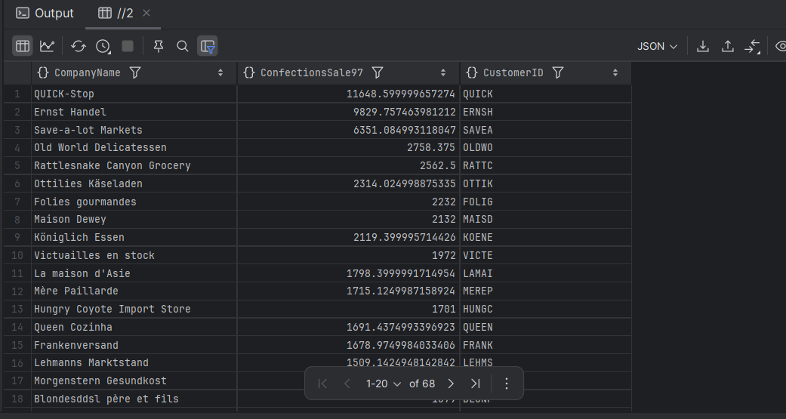
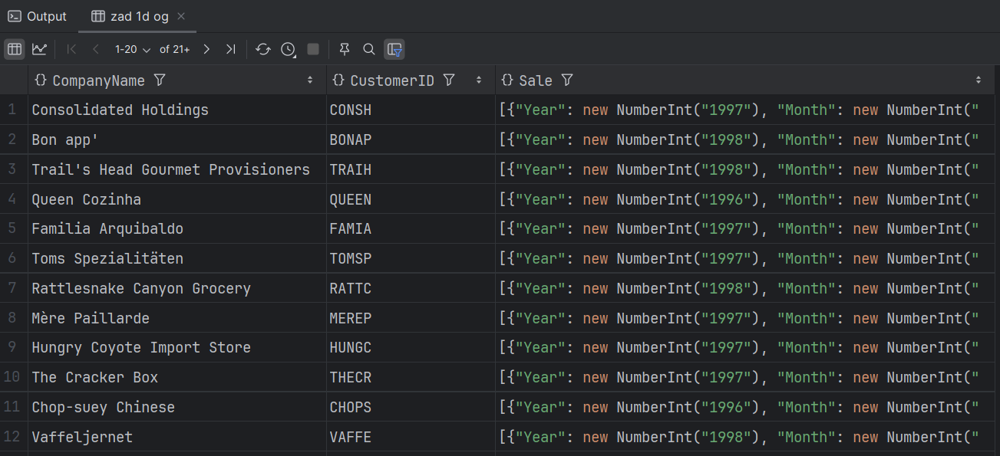
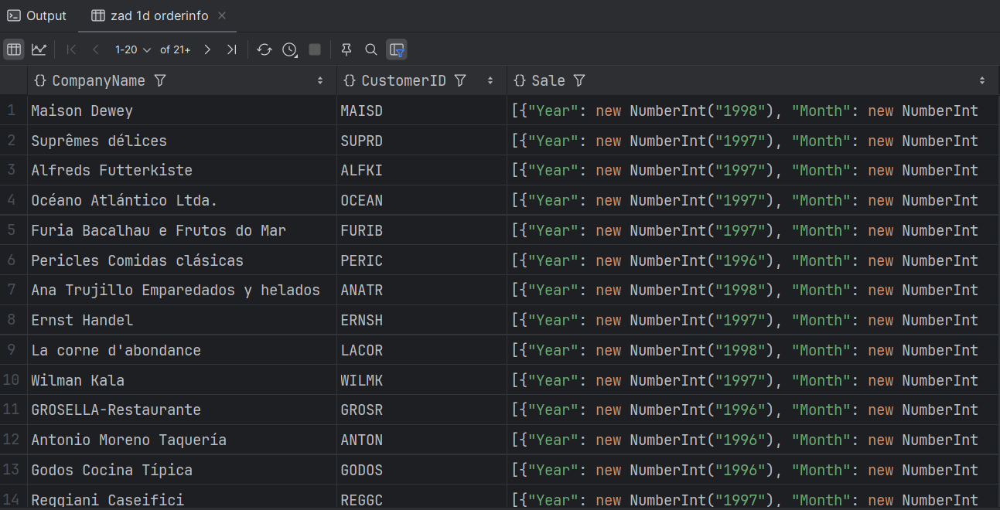
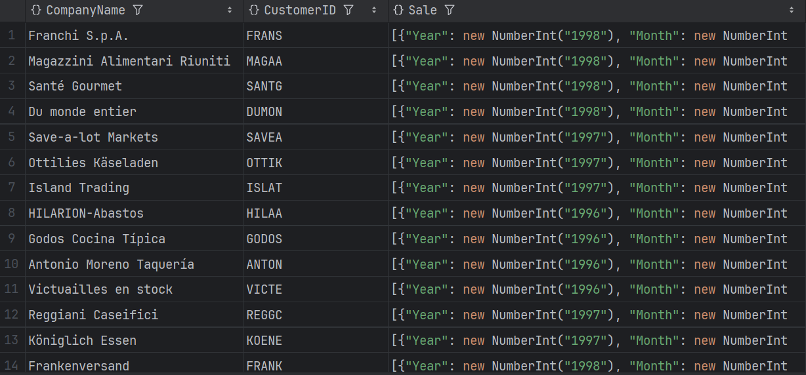

# Dokumentowe bazy danych – MongoDB

Ćwiczenie/zadanie

---

**Imiona i nazwiska autorów:**
**Filip Węgrzyn | Seweryn Tasior**

---

Odtwórz z backupu bazę north0

```
mongorestore --nsInclude='north0.*' ./dump/
```

```
use north0
```

# Zadanie 1 - operacje wyszukiwania danych, przetwarzanie dokumentów

# a)

stwórz kolekcję `OrdersInfo` zawierającą następujące dane o zamówieniach

- pojedynczy dokument opisuje jedno zamówienie

```js
[
  {
    "_id": ...

    OrderID": ... numer zamówienia

    "Customer": {  ... podstawowe informacje o kliencie skladającym
      "CustomerID": ... identyfikator klienta
      "CompanyName": ... nazwa klienta
      "City": ... miasto
      "Country": ... kraj
    },

    "Employee": {  ... podstawowe informacje o pracowniku obsługującym zamówienie
      "EmployeeID": ... idntyfikator pracownika
      "FirstName": ... imie
      "LastName": ... nazwisko
      "Title": ... stanowisko

    },

    "Dates": {
       "OrderDate": ... data złożenia zamówienia
       "RequiredDate": data wymaganej realizacji
    }

    "Orderdetails": [  ... pozycje/szczegóły zamówienia - tablica takich pozycji
      {
        "UnitPrice": ... cena
        "Quantity": ... liczba sprzedanych jednostek towaru
        "Discount": ... zniżka
        "Value": ... wartośc pozycji zamówienia
        "product": { ... podstawowe informacje o produkcie
          "ProductID": ... identyfikator produktu
          "ProductName": ... nazwa produktu
          "QuantityPerUnit": ... opis/opakowannie
          "CategoryID": ... identyfikator kategorii do której należy produkt
          "CategoryName" ... nazwę tej kategorii
        },
      },
      ...
    ],

    "Freight": ... opłata za przesyłkę
    "OrderTotal"  ... sumaryczna wartosc sprzedanych produktów

    "Shipment" : {  ... informacja o wysyłce
        "Shipper": { ... podstawowe inf o przewoźniku
           "ShipperID":
            "CompanyName":
        }
        ... inf o odbiorcy przesyłki
        "ShipName": ...
        "ShipAddress": ...
        "ShipCity": ...
        "ShipCountry": ...
    }
  }
]
```

# b)

stwórz kolekcję `CustomerInfo` zawierającą następujące dane kazdym klencie

- pojedynczy dokument opisuje jednego klienta

```js
[
  {
    "_id": ...

    "CustomerID": ... identyfikator klienta
    "CompanyName": ... nazwa klienta
    "City": ... miasto
    "Country": ... kraj

	"Orders": [ ... tablica zamówień klienta o strukturze takiej jak w punkcie a) (oczywiście bez informacji o kliencie)

	]


]
```

# c)

Napisz polecenie/zapytanie: Dla każdego klienta pokaż wartość zakupionych przez niego produktów z kategorii 'Confections' w 1997r

- Spróbuj napisać to zapytanie wykorzystując

  - oryginalne kolekcje (`customers, orders, orderdertails, products, categories`)
  - kolekcję `OrderInfo`
  - kolekcję `CustomerInfo`

- porównaj zapytania/polecenia/wyniki

```js
[
  {
    "_id":

    "CustomerID": ... identyfikator klienta
    "CompanyName": ... nazwa klienta
	"ConfectionsSale97": ... wartość zakupionych przez niego produktów z kategorii 'Confections'  w 1997r

  }
]
```

# d)

Napisz polecenie/zapytanie: Dla każdego klienta poaje wartość sprzedaży z podziałem na lata i miesiące
Spróbuj napisać to zapytanie wykorzystując - oryginalne kolekcje (`customers, orders, orderdertails, products, categories`) - kolekcję `OrderInfo` - kolekcję `CustomerInfo`

- porównaj zapytania/polecenia/wyniki

```js
[
  {
    "_id":

    "CustomerID": ... identyfikator klienta
    "CompanyName": ... nazwa klienta

	"Sale": [ ... tablica zawierająca inf o sprzedazy
	    {
            "Year":  ....
            "Month": ....
            "Total": ...
	    }
	    ...
	]
  }
]
```

# e)

Załóżmy że pojawia się nowe zamówienie dla klienta 'ALFKI', zawierające dwa produkty 'Chai' oraz "Ikura"

- pozostałe pola w zamówieniu (ceny, liczby sztuk prod, inf o przewoźniku itp. możesz uzupełnić wg własnego uznania)
  Napisz polecenie które dodaje takie zamówienie do bazy
- aktualizując oryginalne kolekcje `orders`, `orderdetails`
- aktualizując kolekcję `OrderInfo`
- aktualizując kolekcję `CustomerInfo`

Napisz polecenie

- aktualizując oryginalną kolekcję orderdetails`
- aktualizując kolekcję `OrderInfo`
- aktualizując kolekcję `CustomerInfo`

# f)

Napisz polecenie które modyfikuje zamówienie dodane w pkt e) zwiększając zniżkę o 5% (dla każdej pozycji tego zamówienia)

Napisz polecenie

- aktualizując oryginalną kolekcję `orderdetails`
- aktualizując kolekcję `OrderInfo`
- aktualizując kolekcję `CustomerInfo`

UWAGA:
W raporcie należy zamieścić kod poleceń oraz uzyskany rezultat, np wynik polecenia `db.kolekcka.fimd().limit(2)` lub jego fragment

## Zadanie 1 - rozwiązanie

> Wyniki:
>
> przykłady, kod, zrzuty ekranów, komentarz ...

### a)

```js
db.createCollection("OrdersInfo", {
  validator: {
    $jsonSchema: {
      bsonType: "object",
      required: [
        "OrderID",
        "Customer",
        "Employee",
        "Dates",
        "Orderdetails",
        "Freight",
        "OrderTotal",
        "Shipment"
      ],
      properties: {
        OrderID: { bsonType: "int", description: "int required" },
        Customer: {
          bsonType: "object",
          required: ["CustomerID", "CompanyName", "City", "Country"],
          properties: {
            CustomerID: { bsonType: "string", description: "string required" },
            CompanyName: { bsonType: "string", description: "string required" },
            City: { bsonType: "string", description: "string required" },
            Country: { bsonType: "string", description: "string required" }
          }
        },
        Employee: {
          bsonType: "object",
          required: ["EmployeeID", "FirstName", "LastName", "Title"],
          properties: {
            EmployeeID: { bsonType: "int", description: "int required" },
            FirstName: { bsonType: "string", description: "string required" },
            LastName: { bsonType: "string", description: "string required" },
            Title: { bsonType: "string", description: "string required" }
          }
        },
        Dates: {
          bsonType: "object",
          required: ["OrderDate", "RequiredDate"],
          properties: {
            OrderDate: { bsonType: "date", description: "date required" },
            RequiredDate: { bsonType: "date", description: "date required" }
          }
        },
        Orderdetails: {
          bsonType: "array",
          items: {
            bsonType: "object",
            required: [
              "UnitPrice",
              "Quantity",
              "Discount",
              "Value",
              "product"
            ],
            properties: {
              UnitPrice: { bsonType: "double", description: "double required" },
              Quantity: { bsonType: "int", description: "int required" },
              Discount: { bsonType: "double", description: "double required" },
              Value: { bsonType: "double", description: "double required" },
              product: {
                bsonType: "object",
                required: [
                  "ProductID",
                  "ProductName",
                  "QuantityPerUnit",
                  "CategoryID",
                  "CategoryName"
                ],
                properties: {
                  ProductID: { bsonType: "int", description: "int required" },
                  ProductName: { bsonType: "string", description: "string required" },
                  QuantityPerUnit: { bsonType: "string", description: "string required" },
                  CategoryID: { bsonType: "int", description: "int required" },
                  CategoryName: { bsonType: "string", description: "string required" }
                }
              }
            }
          }
        },
        Freight: { bsonType: "double", description: "double required" },
        OrderTotal: { bsonType: "double", description: "double required" },
        Shipment: {
          bsonType: "object",
          required: [
            "Shipper",
            "ShipName",
            "ShipAddress",
            "ShipCity",
            "ShipCountry"
          ],
          properties: {
            Shipper: {
              bsonType: "object",
              required: ["ShipperID", "CompanyName"],
              properties: {
                ShipperID: { bsonType: "int", description: "int required" },
                CompanyName: { bsonType: "string", description: "string required" }
              }
            },
            ShipName: { bsonType: "string", description: "string required" },
            ShipAddress: { bsonType: "string", description: "string required" },
            ShipCity: { bsonType: "string", description: "string required" },
            ShipCountry: { bsonType: "string", description: "string required" }
          }
        }
      }
    }
  }
});
//use north0;
db.orderdetails.aggregate([
  {
     $match: {}
  },
  {
    $lookup: {
      from: "products",
      localField: "ProductID",
      foreignField: "ProductID",
      as: "products"
    }
  },
  {
    $unwind: "$products"
  },
   {
    $lookup: {
      from: "categories",
      localField: "products.CategoryID",
      foreignField: "CategoryID",
      as: "categories"
    }
   },
    {
         $unwind: "$categories"
    },
  {
      $addFields: {
          Value: { $multiply: ["$UnitPrice", "$Quantity", { $subtract: [1, "$Discount"] }] },
          product: {
              ProductID:"$products.ProductID",
              ProductName:"$products.ProductName",
              QuantityPerUnit: "$products.QuantityPerUnit",
              CategoryID: "$products.CategoryID",
              CategoryName: "$categories.CategoryName",
          }
      }
   },
   {
    $project:{
         "_id":0,
        "products":0,
        "categories":0,
    }
   },
   {
    $out:"orderdetails_tmp"
   }

])

db.orders.aggregate([
  {
    $match: {}
  },
  //customers
  {
    $lookup: {
      from: "customers",
      localField: "CustomerID",
      foreignField: "CustomerID",
      as: "Customer"
    }
  },
  {
    $unwind: "$Customer"
  },
  {
      $project : {
          "Customer._id": 0,
          "Customer.ContactName": 0,
          "Customer.ContactTitle": 0,
          // "Customer.City": 0,
          // "Customer.Country": 0,
          "Customer.Address": 0,
          "Customer.PostalCode": 0,
          "Customer.Region": 0,
          "Customer.Phone": 0,
          "Customer.Fax": 0
         }
  },
  //employees
  {
    $lookup: {
      from: "employees",
      localField: "EmployeeID",
      foreignField: "EmployeeID",
      as: "Employee"
    }
  },
   {
      $unwind: "$Employee"
    },
  {
      $project : {
          "Employee._id": 0,
          //"Employee.Title": 0,
          "Employee.TitleOfCourtesy": 0,
          "Employee.BirthDate": 0,
          "Employee.HireDate": 0,
          "Employee.Address": 0,
          "Employee.PostalCode": 0,
          "Employee.City": 0,
          "Employee.Region": 0,
          "Employee.Country": 0,
          "Employee.HomePhone": 0,
          "Employee.Extension": 0,
          "Employee.Photo": 0,
          "Employee.Notes": 0,
          "Employee.ReportsTo": 0,
          "Employee.PhotoPath": 0
      }
  },
  //Dates
  {
      $addFields: {
          Dates: {
              OrderDate: "$OrderDate",
              RequiredDate: "$RequiredDate",
  
          }
      }
  },
  //Orderdetails
  {
    $lookup : {
        from: "orderdetails_tmp",
        localField: "OrderID",
        foreignField: "OrderID",
        as: "Orderdetails"
    }
  },
  {
    $project : {
        "Orderdetails.OrderID": 0,
        "Orderdetails._id": 0
    }
  },
   //Shippers
   {
      $lookup : {
          from: "shippers",
          localField: "ShipVia",
          foreignField: "ShipperID",
          as: "shippers"
      }
    },
  {
    $unwind:"$shippers"
  },
  
   {
      $addFields: {
      "Orderdetails": {
            $map: {
              input: "$Orderdetails",
              as: "od",
              in: {
                UnitPrice: { $toDouble: "$$od.UnitPrice" },
                Quantity: "$$od.Quantity",
                Discount: { $toDouble:"$$od.Discount" },
                Value: { $toDouble: "$$od.Value" },
                product: "$$od.product"
              }
            }
          },
       Freight: { $toDouble: "$Freight" },
       OrderTotal: { $toDouble: { $sum: "$orderdetails.Value" } },
        Shipment:{
            Shipper:{
               ShipperID:"$shippers.ShipperID",
               CompanyName:"$shippers.CompanyName",
            },
            ShipName:"$ShipName" ,
            ShipAddress:"$ShipAddress" ,
            ShipCity: "$ShipCity" ,
            ShipCountry:"$ShipCountry"
            }
        }
  
   },
  {
    $project: {
      _id: 0,
      shippers: 0,
      "CustomerID":0,
      "EmployeeID":0,
      "OrderDate":0,
      "RequiredDate":0,
      "ShipAddress":0,
      "ShipCity":0,
      "ShipCountry":0,
      "ShipName":0,
      "ShipPostalCode":0,
      "ShipRegion":0,
      "ShipVia":0,
      "ShippedDate":0
    }
  },
  {
    $out:"OrdersInfo"
  }
  ]);

```

### b)

```js
db.createCollection("CustomerInfo", {
  validator: {
    $jsonSchema: {
      bsonType: "object",
      required: ["CustomerID", "CompanyName", "City", "Country", "Orders"],
      properties: {
        CustomerID: {
          bsonType: "string",
          description: "string required",
        },
        CompanyName: {
          bsonType: "string",
          description: "string required",
        },
        City: {
          bsonType: "string",
          description: "string required",
        },
        Country: {
          bsonType: "string",
          description: "string required",
        },
        Orders: {
          bsonType: "array",
          description: "array required",
          items: {
            bsonType: "object",
            properties: {
              OrderID: {
                bsonType: "int",
                description: "int required",
              },
              Employee: {
                bsonType: "object",
                properties: {
                  EmployeeID: {
                    bsonType: "int",
                    description: "int required",
                  },
                  FirstName: {
                    bsonType: "string",
                    description: "string required",
                  },
                  LastName: {
                    bsonType: "string",
                    description: "string required",
                  },
                  Title: {
                    bsonType: "string",
                    description: "string required",
                  },
                },
              },
              Dates: {
                bsonType: "object",
                properties: {
                  OrderDate: {
                    bsonType: "date",
                    description: "date required",
                  },
                  RequiredDate: {
                    bsonType: "date",
                    description: "date required",
                  },
                },
              },
              Orderdetails: {
                bsonType: "array",
                items: {
                  bsonType: "object",
                  properties: {
                    UnitPrice: {
                      bsonType: "double",
                      description: "double required",
                    },
                    Quantity: {
                      bsonType: "int",
                      description: "int required",
                    },
                    Discount: {
                      bsonType: "double",
                      description: "double required",
                    },
                    Value: {
                      bsonType: "double",
                      description: "double required",
                    },
                    product: {
                      bsonType: "object",
                      properties: {
                        ProductID: {
                          bsonType: "int",
                          description: "int required",
                        },
                        ProductName: {
                          bsonType: "string",
                          description: "string required",
                        },
                        QuantityPerUnit: {
                          bsonType: "string",
                          description: "string required",
                        },
                        CategoryID: {
                          bsonType: "int",
                          description: "int required",
                        },
                        CategoryName: {
                          bsonType: "string",
                          description: "string required",
                        },
                      },
                    },
                  },
                },
              },
              Freight: {
                bsonType: "double",
                description: "double required",
              },
              OrderTotal: {
                bsonType: "double",
                description: "double required",
              },
              Shipment: {
                bsonType: "object",
                properties: {
                  Shipper: {
                    bsonType: "object",
                    properties: {
                      ShipperID: {
                        bsonType: "int",
                        description: "int required",
                      },
                      CompanyName: {
                        bsonType: "string",
                        description: "string required",
                      },
                    },
                  },
                  ShipName: {
                    bsonType: "string",
                    description: "string required",
                  },
                  ShipAddress: {
                    bsonType: "string",
                    description: "string required",
                  },
                  ShipCity: {
                    bsonType: "string",
                    description: "string required",
                  },
                  ShipCountry: {
                    bsonType: "string",
                    description: "string required",
                  },
                },
              },
            },
          },
        },
      },
    },
  },
});

db.customers.aggregate([
  {
    $lookup: {
      from: "OrdersInfo",
      localField: "CustomerID",
      foreignField: "Customer.CustomerID",
      as: "OrdersInfo",
    },
  },
  { $unwind: "$OrdersInfo" },

  {
    $group: {
      _id: "$CustomerID",
      CustomerID: { $first: "$CustomerID" },
      CompanyName: { $first: "$CompanyName" },
      City: { $first: "$City" },
      Country: { $first: "$Country" },
      Orders: {
        $push: {
          OrderID: "$OrdersInfo.OrderID",
          Dates: "$OrdersInfo.Dates",
          Employee: "$OrdersInfo.Employee",
          Freight: "$OrdersInfo.Freight",
          OrderTotal: "$OrdersInfo.OrderTotal",
          Shipment: "$OrdersInfo.Shipment",
          Orderdetails: "$OrdersInfo.Orderdetails",
        },
      },
    },
  },
  {
    $project: {
      _id: 0,
      CustomerID: 1,
      CompanyName: 1,
      City: 1,
      Country: 1,
      Orders: 1,
    },
  },

  {
    $merge: {
      into: "CustomerInfo",
    },
  },
]);
```



### c)
```js
 //1
    db.customers.aggregate([
        {
            $match: {},
            },
        {
            $lookup: {
                from: "orders",
                localField: "CustomerID",
                foreignField: "CustomerID",
                as: "orders",
                },
            },
        {
            $unwind: "$orders",
            },
        {
            $match: {
                $expr: {
                    $eq: [{ $year: "$orders.OrderDate" }, 1997],
                    },
                },
            },
        {
            $lookup: {
                from: "orderdetails",
                localField: "orders.OrderID",
                foreignField: "OrderID",
                as: "orderdetails",
                },
            },
        {
            $unwind: "$orderdetails",
            },
        {
            $lookup: {
                from: "products",
                localField: "orderdetails.ProductID",
                foreignField: "ProductID",
                as: "products",
                },
            },
        {
            $unwind: "$products",
            },
        {
            $lookup: {
                from: "categories",
                localField: "products.CategoryID",
                foreignField: "CategoryID",
                as: "categories",
                },
            },
        {
            $unwind: "$categories",
            },
        {
            $match: {
                "categories.CategoryName": "Confections",
                },
            },
        {
            $group: {
                _id: "$_id",
                CustomerID: { $first: "$CustomerID" },
                CompanyName: { $first: "$CompanyName" },
                ConfectionsSale97: {
                    $sum: {
                        $multiply: [
                            { $subtract: [1, "$orderdetails.Discount"] },
                            "$orderdetails.UnitPrice",
                            "$orderdetails.Quantity",
                            ],
                        },
                    },
                },
            },
        {
            $sort: {
                ConfectionsSale97: -1,
                },
            },
        ]);

    //2
    db.OrdersInfo.aggregate([
        {
            $match: {
                $expr: { $eq: [{ $year: "$Dates.OrderDate" }, 1997] }
                }
            },
        {
            $unwind: "$Orderdetails"
            },
        {
            $match: {
                "Orderdetails.product.CategoryName": "Confections"
                }
            },
        {
            $group: {
                _id: "$Customer.CustomerID",
                CustomerID: { $first: "$Customer.CustomerID" },
                CompanyName: { $first: "$Customer.CompanyName" },
                ConfectionsSale97: {
                    $sum: {
                        $multiply: [
                            { $subtract: [1, "$Orderdetails.Discount"] },
                            "$Orderdetails.UnitPrice",
                            "$Orderdetails.Quantity"
                            ]
                        }
                    }
                }
            },
        {

            $project: {
                _id: 0,
                CustomerID: "$_id",
                CompanyName: 1,
                ConfectionsSale97: 1
                }
            },
        {
            $sort: {
                ConfectionsSale97: -1
                }
            }
        ]);
    //3
    db.CustomerInfo.aggregate([
        {
            $unwind: "$Orders",
            },
        {
            $match: {
                $expr: { $eq: [{ $year: { $toDate: "$Orders.Dates.OrderDate"} }, 1997] }
                }
            },
        {
            $unwind: "$Orders.Orderdetails",
            },
        {
            $match: {
                "Orders.Orderdetails.product.CategoryName": "Confections",
                },
            },
        {
            $group: {
                _id: "$_id",
                CustomerID: { $first: "$CustomerID" },
                CompanyName: { $first: "$CompanyName" },
                ConfectionsSale97: {
                    $sum: {
                        $multiply: [
                            { $subtract: [1, "$Orders.Orderdetails.Discount"] },
                            "$Orders.Orderdetails.UnitPrice",
                            "$Orders.Orderdetails.Quantity",
                            ],
                        },
                    },
                },
            },
        {
            $sort: {
                ConfectionsSale97: -1,
                },
            },
        ]);
```

### zdjecie dla c) wersja 1

### zdjecie dla c) wersja 2

### d)

```js
// zad 1d original
db.customers.aggregate([
  {
    $lookup: {
      from: "orders",
      localField: "CustomerID",
      foreignField: "CustomerID",
      as: "Orders",
    },
  },
  { $unwind: "$Orders" },
  {
    $lookup: {
      from: "orderdetails",
      localField: "Orders.OrderID",
      foreignField: "OrderID",
      as: "Orderdetails",
    },
  },
  { $unwind: "$Orderdetails" },
  {
    $group: {
      _id: {
        CustomerID: "$CustomerID",
        CompanyName: "$CompanyName",
        Year: { $year: "$Orders.OrderDate" },
        Month: { $month: "$Orders.OrderDate" },
      },
      Total: {
        $sum: {
          $multiply: [
            "$Orderdetails.UnitPrice",
            "$Orderdetails.Quantity",
            { $subtract: [1, "$Orderdetails.Discount"] },
          ],
        },
      },
    },
  },
  {
    $group: {
      _id: "$_id.CustomerID",
      CompanyName: { $first: "$_id.CompanyName" },
      Sale: {
        $push: {
          Year: "$_id.Year",
          Month: "$_id.Month",
          Total: "$Total",
        },
      },
    },
  },
  {
    $project: {
      _id: 0,
      CustomerID: "$_id",
      CompanyName: 1,
      Sale: 1,
    },
  },
]);
```



```js
//zad 1d orderinfo
db.OrdersInfo.aggregate([
  { $unwind: "$Orderdetails" },

  {
    $group: {
      _id: {
        CustomerID: "$Customer.CustomerID",
        CompanyName: "$Customer.CompanyName",
        Year: { $year: "$Dates.OrderDate" },
        Month: { $month: "$Dates.OrderDate" },
      },
      Total: { $sum: "$Orderdetails.Value" },
    },
  },

  {
    $group: {
      _id: "$_id.CustomerID",
      CompanyName: { $first: "$_id.CompanyName" },
      Sale: {
        $push: {
          Year: "$_id.Year",
          Month: "$_id.Month",
          Total: "$Total",
        },
      },
    },
  },

  {
    $project: {
      _id: 0,
      CustomerID: "$_id",
      CompanyName: 1,
      Sale: 1,
    },
  },
]);
```



```js
//zad1d customerinfo
db.CustomerInfo.aggregate([
  { $unwind: "$Orders" },
  { $unwind: "$Orders.Orderdetails" },
  {
    $group: {
      _id: {
        CustomerID: "$CustomerID",
        CompanyName: "$CompanyName",
        Year: { $year: "$Orders.Dates.OrderDate" },
        Month: { $month: "$Orders.Dates.OrderDate" },
      },
      Total: { $sum: "$Orders.Orderdetails.Value" },
    },
  },

  {
    $group: {
      _id: "$_id.CustomerID",
      CompanyName: { $first: "$_id.CompanyName" },
      Sale: {
        $push: {
          Year: "$_id.Year",
          Month: "$_id.Month",
          Total: "$Total",
        },
      },
    },
  },

  {
    $project: {
      _id: 0,
      CustomerID: "$_id",
      CompanyName: 1,
      Sale: 1,
    },
  },
]);
```


### e)

```js
const newOrderId = 12345;

db.orders.insertOne({
  OrderID: newOrderId,
  CustomerID: "ALFKI",
  EmployeeID: 5,
  OrderDate: ISODate("2025-04-16T00:00:00Z"),
  RequiredDate: ISODate("2025-05-16T00:00:00Z"),
  ShipVia: 3,
  Freight: 15.0,
  ShipName: "Alfreds Futterkiste",
  ShipAddress: "Obere Str. 57",
  ShipCity: "Berlin",
  ShipCountry: "Germany",
});

db.orderdetails.insertMany([
  {
    OrderID: newOrderId,
    ProductID: 1,
    UnitPrice: 18.0,
    Quantity: 10,
    Discount: 0,
  },
  {
    OrderID: newOrderId,
    ProductID: 31,
    UnitPrice: 62.5,
    Quantity: 5,
    Discount: 0.05,
  },
]);

db.OrdersInfo.insertOne({
  OrderID: newOrderId,
  Customer: {
    CustomerID: "ALFKI",
    CompanyName: "Alfreds Futterkiste",
    City: "Berlin",
    Country: "Germany",
  },
  Employee: {
    EmployeeID: 5,
    FirstName: "Steven",
    LastName: "Buchanan",
    Title: "Sales Manager",
  },
  Dates: {
    OrderDate: ISODate("2025-04-16T00:00:00Z"),
    RequiredDate: ISODate("2025-05-16T00:00:00Z"),
  },
  Orderdetails: [
    {
      UnitPrice: 18.0,
      Quantity: 10,
      Discount: 0,
      Value: 180.0,
      product: {
        ProductID: 1,
        ProductName: "Chai",
        QuantityPerUnit: "10 boxes x 20 bags",
        CategoryID: 1,
        CategoryName: "Beverages",
      },
    },
    {
      UnitPrice: 62.5,
      Quantity: 5,
      Discount: 0.05,
      Value: 296.875,
      product: {
        ProductID: 31,
        ProductName: "Ikura",
        QuantityPerUnit: "12 - 200 g jars",
        CategoryID: 8,
        CategoryName: "Seafood",
      },
    },
  ],
  Freight: 15.0,
  OrderTotal: 476.875,
  Shipment: {
    Shipper: { ShipperID: 3, CompanyName: "Federal Shipping" },
    ShipName: "Alfreds Futterkiste",
    ShipAddress: "Obere Str. 57",
    ShipCity: "Berlin",
    ShipCountry: "Germany",
  },
});
db.CustomerInfo.updateOne(
  { CustomerID: "ALFKI" },
  {
    $push: {
      Orders: {
        OrderID: newOrderId,
        Dates: {
          OrderDate: ISODate("2025-04-16T00:00:00Z"),
          RequiredDate: ISODate("2025-05-16T00:00:00Z"),
        },
        Employee: {
          EmployeeID: 5,
          FirstName: "Steven",
          LastName: "Buchanan",
          Title: "Sales Manager",
        },
        Freight: 15.0,
        OrderTotal: 476.875,
        Shipment: {
          Shipper: { ShipperID: 3, CompanyName: "Federal Shipping" },
          ShipName: "Alfreds Futterkiste",
          ShipAddress: "Obere Str. 57",
          ShipCity: "Berlin",
          ShipCountry: "Germany",
        },
        Orderdetails: [
          {
            UnitPrice: 18.0,
            Quantity: 10,
            Discount: 0,
            Value: 180.0,
            product: {
              ProductID: 1,
              ProductName: "Chai",
              QuantityPerUnit: "10 boxes x 20 bags",
              CategoryID: 1,
              CategoryName: "Beverages",
            },
          },
          {
            UnitPrice: 62.5,
            Quantity: 5,
            Discount: 0.05,
            Value: 296.875,
            product: {
              ProductID: 31,
              ProductName: "Ikura",
              QuantityPerUnit: "12 - 200 g jars",
              CategoryID: 8,
              CategoryName: "Seafood",
            },
          },
        ],
      },
    },
  }
);
```
### f)
```js
const newOrderId = 12345;

 db.orders.insertOne({
  OrderID: newOrderId,
  CustomerID: "ALFKI",
  EmployeeID: 5,
  OrderDate: ISODate("2025-04-16T00:00:00Z"),
  RequiredDate: ISODate("2025-05-16T00:00:00Z"),
  ShipVia: 3,
  Freight: 15.00,
  ShipName: "Alfreds Futterkiste",
  ShipAddress: "Obere Str. 57",
  ShipCity: "Berlin",
  ShipCountry: "Germany"
});

db.orderdetails.insertMany([
  {
    OrderID: newOrderId,
    ProductID: 1,
    UnitPrice: 18.00,
    Quantity: 10,
    Discount: 0
  },
  {
    OrderID: newOrderId,
    ProductID: 31,
    UnitPrice: 62.50,
    Quantity: 5,
    Discount: 0.05
  }
]);

db.OrdersInfo.insertOne({
  OrderID: newOrderId,
  Customer: {
    CustomerID: "ALFKI",
    CompanyName: "Alfreds Futterkiste",
    City: "Berlin",
    Country: "Germany"
  },
  Employee: {
    EmployeeID: 5,
    FirstName: "Steven",
    LastName: "Buchanan",
    Title: "Sales Manager"
  },
  Dates: {
    OrderDate: ISODate("2025-04-16T00:00:00Z"),
    RequiredDate: ISODate("2025-05-16T00:00:00Z")
  },
  Orderdetails: [
    {
      UnitPrice: 18.00,
      Quantity: 10,
      Discount: 0,
      Value: 180.00,
      product: {
        ProductID: 1,
        ProductName: "Chai",
        QuantityPerUnit: "10 boxes x 20 bags",
        CategoryID: 1,
        CategoryName: "Beverages"
      }
    },
    {
      UnitPrice: 62.50,
      Quantity: 5,
      Discount: 0.05,
      Value: 296.875,
      product: {
        ProductID: 31,
        ProductName: "Ikura",
        QuantityPerUnit: "12 - 200 g jars",
        CategoryID: 8,
        CategoryName: "Seafood"
      }
    }
  ],
  Freight: 15.00,
  OrderTotal: 476.875,
  Shipment: {
    Shipper: { ShipperID: 3, CompanyName: "Federal Shipping" },
    ShipName: "Alfreds Futterkiste",
    ShipAddress: "Obere Str. 57",
    ShipCity: "Berlin",
    ShipCountry: "Germany"
  }
});

 db.CustomerInfo.updateOne(
  { CustomerID: "ALFKI" },
  {
    $push: {
      Orders: {
        OrderID: newOrderId,
        Dates: { OrderDate: ISODate("2025-04-16T00:00:00Z"), RequiredDate: ISODate("2025-05-16T00:00:00Z") },
        Employee: { EmployeeID: 5, FirstName: "Steven", LastName: "Buchanan", Title: "Sales Manager" },
        Freight: 15.00,
        OrderTotal: 476.875,
        Shipment: { Shipper: { ShipperID: 3, CompanyName: "Federal Shipping" }, ShipName: "Alfreds Futterkiste", ShipAddress: "Obere Str. 57", ShipCity: "Berlin", ShipCountry: "Germany" },
        Orderdetails: [
          { UnitPrice: 18.00, Quantity: 10, Discount: 0, Value: 180.00, product: { ProductID: 1, ProductName: "Chai", QuantityPerUnit: "10 boxes x 20 bags", CategoryID: 1, CategoryName: "Beverages" } },
          { UnitPrice: 62.50, Quantity: 5, Discount: 0.05, Value: 296.875, product: { ProductID: 31, ProductName: "Ikura", QuantityPerUnit: "12 - 200 g jars", CategoryID: 8, CategoryName: "Seafood" } }
        ]
      }
    }
  }
);
```

....

# Zadanie 2 - modelowanie danych

Zaproponuj strukturę bazy danych dla wybranego/przykładowego zagadnienia/problemu

Należy wybrać jedno zagadnienie/problem (A lub B lub C)

Przykład A

- Wykładowcy, przedmioty, studenci, oceny
  - Wykładowcy prowadzą zajęcia z poszczególnych przedmiotów
  - Studenci uczęszczają na zajęcia
  - Wykładowcy wystawiają oceny studentom
  - Studenci oceniają zajęcia

Przykład B

- Firmy, wycieczki, osoby
  - Firmy organizują wycieczki
  - Osoby rezerwują miejsca/wykupują bilety
  - Osoby oceniają wycieczki

Przykład C

- Własny przykład o podobnym stopniu złożoności

a) Zaproponuj różne warianty struktury bazy danych i dokumentów w poszczególnych kolekcjach oraz przeprowadzić dyskusję każdego wariantu (wskazać wady i zalety każdego z wariantów)

- zdefiniuj schemat/reguły walidacji danych
- wykorzystaj referencje
- dokumenty zagnieżdżone
- tablice

b) Kolekcje należy wypełnić przykładowymi danymi

c) W kontekście zaprezentowania wad/zalet należy zaprezentować kilka przykładów/zapytań/operacji oraz dla których dedykowany jest dany wariant

W sprawozdaniu należy zamieścić przykładowe dokumenty w formacie JSON ( pkt a) i b)), oraz kod zapytań/operacji (pkt c)), wraz z odpowiednim komentarzem opisującym strukturę dokumentów oraz polecenia ilustrujące wykonanie przykładowych operacji na danych

Do sprawozdania należy kompletny zrzut wykonanych/przygotowanych baz danych (taki zrzut można wykonać np. za pomocą poleceń `mongoexport`, `mongdump` …) oraz plik z kodem operacji/zapytań w wersji źródłowej (np. plik .js, np. plik .md ), załącznik powinien mieć format zip

## Zadanie 2 - rozwiązanie

> Wyniki:
>
> przykłady, kod, zrzuty ekranów, komentarz ...

### Postanowiliśmy przeanalizować 3 modele bazy danych.

**Model 1**  
Znormalizowane kolekcje bez redundancji danych i zagnieżdżeń

```js
// Company1
db.createCollection("Company1", {
  validator: {
    $jsonSchema: {
      bsonType: "object",
      required: ["name", "address"],
      properties: {
        _id: { bsonType: "objectId" },
        name: { bsonType: "string", description: "string required" },
        address: { bsonType: "string", description: "string required" },
      },
    },
  },
});

// Person1
db.createCollection("Person1", {
  validator: {
    $jsonSchema: {
      bsonType: "object",
      required: ["firstname", "lastname"],
      properties: {
        _id: { bsonType: "objectId" },
        firstname: { bsonType: "string", description: "string required" },
        lastname: { bsonType: "string", description: "string required" },
      },
    },
  },
});

// Trip1
db.createCollection("Trip1", {
  validator: {
    $jsonSchema: {
      bsonType: "object",
      required: ["name", "destination", "date", "max_places", "companyId"],
      properties: {
        _id: { bsonType: "objectId" },
        name: { bsonType: "string", description: "string required" },
        destination: { bsonType: "string", description: "string required" },
        date: { bsonType: "date", description: "date required" },
        max_places: {
          bsonType: "int",
          minimum: 1,
          description: "int>=1 required",
        },
        companyId: {
          bsonType: "objectId",
          description: "fkey to Company1._id",
        },
      },
    },
  },
});

// Rating1
db.createCollection("Rating1", {
  validator: {
    $jsonSchema: {
      bsonType: "object",
      required: ["tripId", "personId", "rating"],
      properties: {
        _id: { bsonType: "objectId" },
        tripId: { bsonType: "objectId", description: "fkey to Trip1._id" },
        personId: { bsonType: "objectId", description: "fkey to Person1._id" },
        rating: { bsonType: "int", minimum: 1, maximum: 5 },
      },
    },
  },
});

// Reservation1
db.createCollection("Reservation1", {
  validator: {
    $jsonSchema: {
      bsonType: "object",
      required: ["tripId", "personId", "no_tickets"],
      properties: {
        _id: { bsonType: "objectId" },
        tripId: { bsonType: "objectId", description: "fkey to Trip1._id" },
        personId: { bsonType: "objectId", description: "fkey to Person1._id" },
        no_tickets: { bsonType: "int", minimum: 1 },
      },
    },
  },
});
```

Wpisanie danych do modelu 1:

```js
// 2a) Firmy – każda pojedynczo, z odczytem insertedId
var resTravelCo  = db.Company1.insertOne({ name: "TravelCo",      address: "ul. Podróżnicza 10, Warszawa" });
var resAdventure = db.Company1.insertOne({ name: "AdventureTime", address: "ul. Wyprawowa 5, Kraków" });
var compTravelCoId  = resTravelCo.insertedId;
var compAdventureId = resAdventure.insertedId;


// 2b) Wycieczki – każda pojedynczo, z odczytem insertedId
var resMazury = db.Trip1.insertOne({
  name:        "Mazury Tour",
  destination: "Mazury",
  date:        ISODate("2025-03-10"),
  max_places:  20,
  companyId:   compTravelCoId
});
var resTatry = db.Trip1.insertOne({
  name:        "Tatry Hike",
  destination: "Tatry",
  date:        ISODate("2025-07-15"),
  max_places:  15,
  companyId:   compTravelCoId
});
var resCity = db.Trip1.insertOne({
  name:        "City Break",
  destination: "Wrocław",
  date:        ISODate("2025-05-20"),
  max_places:  25,
  companyId:   compAdventureId
});
var tripMazuryId = resMazury.insertedId;
var tripTatryId  = resTatry.insertedId;
var tripCityId   = resCity.insertedId;


// 2c) Osoby – każda pojedynczo lub grupowo, ale potem rozbijamy wyniki
// Tu możemy użyć insertMany, ale i tak zrobimy extract na każdy index
vvar resAnna  = db.Person1.insertOne({ firstname: "Anna",  lastname: "Kowalska" });
var resPiotr = db.Person1.insertOne({ firstname: "Piotr", lastname: "Nowak" });
var resEwa   = db.Person1.insertOne({ firstname: "Ewa",   lastname: "Wiśniewska" });
var resJan   = db.Person1.insertOne({ firstname: "Jan",   lastname: "Kowalczyk" });
var resMaria = db.Person1.insertOne({ firstname: "Maria", lastname: "Lewandowska" });
var resTomasz = db.Person1.insertOne({ firstname: "Tomasz", lastname: "Lis" });

var persAnnaId  = resAnna.insertedId;
var persPiotrId = resPiotr.insertedId;
var persEwaId   = resEwa.insertedId;
var persJanId    = resJan.insertedId;
var persMariaId  = resMaria.insertedId;
var persTomaszId = resTomasz.insertedId;


// 2d) Oceny
db.Rating1.insertMany([
  { tripId: tripMazuryId, personId: persAnnaId,  rating: 5 },
  { tripId: tripTatryId, personId: persAnnaId,  rating: 2 },
  { tripId: tripMazuryId, personId: persPiotrId, rating: 4 },
  { tripId: tripTatryId,  personId: persJanId,   rating: 3 },
  { tripId: tripCityId,   personId: persMariaId, rating: 5 },
  { tripId: tripCityId,   personId: persTomaszId, rating: 2 }
]);


// 2e) Rezerwacje
db.Reservation1.insertMany([
  { tripId: tripMazuryId, personId: persAnnaId,   no_tickets: 2 },
  { tripId: tripTatryId, personId: persAnnaId,  no_tickets: 2 },
  { tripId: tripTatryId,  personId: persPiotrId,  no_tickets: 1 },
  { tripId: tripTatryId,  personId: persJanId,    no_tickets: 3 },
  { tripId: tripCityId,   personId: persMariaId,  no_tickets: 4 },
  { tripId: tripCityId,   personId: persTomaszId, no_tickets: 1 },
  { tripId: tripMazuryId, personId: persEwaId,    no_tickets: 2 }
]);
```
**Model 2**  

Wszystkie dane zagnieżdżone w dwóch kolekcjach: **PersonInfo** i **TripInfo**

 * a) Tworzenie kolekcji:
```sql
db.createCollection("TripInfo", {
    validator: {
      $jsonSchema: {
        bsonType: "object",
        required: [
          "name",
          "destination",
          "date",
          "max_places",
          "company",
          "reservations"
        ],
        properties: {
          _id: { bsonType: "objectId" },
          name: { bsonType: "string", description: "string required" },
          destination: { bsonType: "string", description: "string required" },
          date: { bsonType: "date", description: "date required" },
          max_places: {
            bsonType: "int",
            minimum: 1,
            description: "int>=1 required"
          },
          company: {
            bsonType: "object",
            required: ["_id", "name", "address"],
            properties: {
              _id: { bsonType: "objectId", description: "fkey to Company1._id" },
              name: { bsonType: "string", description: "string required" },
              address: { bsonType: "string", description: "string required" }
            }
          },
          reservations: {
            bsonType: "array",
            description: "osoby z ilością miejsc i oceną",
            items: {
              bsonType: "object",
              required: ["personId", "firstname", "lastname", "no_tickets", "rating"],
              properties: {
                personId: { bsonType: "objectId", description: "fkey to Person1._id" },
                firstname: { bsonType: "string", description: "string required" },
                lastname: { bsonType: "string", description: "string required" },
                no_tickets: { bsonType: "int", minimum: 1 },
                rating: { bsonType: ["int", "null"], minimum: 1, maximum: 5 }
              }
            }
          }
        }
      }
    }
  });
// PersonInfo – kolekcja agregująca dane o osobie, jej rezerwacjach (z podstawowymi danymi o wycieczce i firmie) oraz ocenach tej osoby
db.createCollection("PersonInfo", {
    validator: {
      $jsonSchema: {
        bsonType: "object",
        required: [
          "firstname",
          "lastname",
          "reservations"
        ],
        properties: {
          _id: { bsonType: "objectId" },
          firstname: { bsonType: "string", description: "string required" },
          lastname: { bsonType: "string", description: "string required" },
          reservations: {
            bsonType: "array",
            description: "rezerwacje osoby z danymi o wycieczce, firmie i oceną",
            items: {
              bsonType: "object",
              required: [
                "tripId",
                "name",
                "destination",
                "date",
                "company",
                "no_tickets",
                "rating"
              ],
              properties: {
                tripId: { bsonType: "objectId", description: "fkey to Trip1._id" },
                name: { bsonType: "string", description: "string required" },
                destination: { bsonType: "string", description: "string required" },
                date: { bsonType: "date", description: "date required" },
                company: {
                  bsonType: "object",
                  required: ["_id", "name", "address"],
                  properties: {
                    _id: { bsonType: "objectId", description: "fkey to Company1._id" },
                    name: { bsonType: "string", description: "string required" },
                    address: { bsonType: "string", description: "string required" }
                  }
                },
                no_tickets: { bsonType: "int", minimum: 1 },
                rating: { bsonType: ["int", "null"], minimum: 1, maximum: 5 }
              }
            }
          }
        }
      }
    }
  });
```
 * b) Wypełnienie kolekcji danymi z modelu 1
```sql
//Wypełnienie kolekcji PersonInfo
  db.Person1.aggregate([
    {
      $lookup: {
        from: "Reservation1",
        localField: "_id",
        foreignField: "personId",
        as: "reservations"
      }
    },
    {
      $lookup: {
        from: "Trip1",
        localField: "reservations.tripId",
        foreignField: "_id",
        as: "trips"
      }
    },
    {
      $lookup: {
        from: "Company1",
        localField: "trips.companyId",
        foreignField: "_id",
        as: "companies"
      }
    },
    {
      $lookup: {
        from: "Rating1",
        localField: "_id",
        foreignField: "personId",
        as: "ratings"
      }
    },
    {
      $addFields: {
        reservations: {
          $map: {
            input: "$reservations",
            as: "res",
            in: {
              tripId: "$$res.tripId",
              no_tickets: "$$res.no_tickets",
              // Pobierz dane o wycieczce
              name: {
                $arrayElemAt: [
                  "$trips.name",
                  { $indexOfArray: ["$trips._id", "$$res.tripId"] }
                ]
              },
              destination: {
                $arrayElemAt: [
                  "$trips.destination",
                  { $indexOfArray: ["$trips._id", "$$res.tripId"] }
                ]
              },
              date: {
                $arrayElemAt: [
                  "$trips.date",
                  { $indexOfArray: ["$trips._id", "$$res.tripId"] }
                ]
              },
              // Pobierz dane o firmie
              company: {
                _id: {
                  $arrayElemAt: [
                    "$companies._id",
                    { $indexOfArray: ["$companies._id",
                      { $arrayElemAt: [
                        "$trips.companyId",
                        { $indexOfArray: ["$trips._id", "$$res.tripId"] }
                      ]}
                    ]}
                  ]
                },
                name: {
                  $arrayElemAt: [
                    "$companies.name",
                    { $indexOfArray: ["$companies._id",
                      { $arrayElemAt: [
                        "$trips.companyId",
                        { $indexOfArray: ["$trips._id", "$$res.tripId"] }
                      ]}
                    ]}
                  ]
                },
                address: {
                  $arrayElemAt: [
                    "$companies.address",
                    { $indexOfArray: ["$companies._id",
                      { $arrayElemAt: [
                        "$trips.companyId",
                        { $indexOfArray: ["$trips._id", "$$res.tripId"] }
                      ]}
                    ]}
                  ]
                }
              },
              // Pobierz ocenę tej osoby dla tej wycieczki
              rating: {
                $arrayElemAt: [
                  "$ratings.rating",
                  { $indexOfArray: ["$ratings.tripId", "$$res.tripId"] }
                ]
              }
            }
          }
        }
      }
    },
    {
      $project: {
        firstname: 1,
        lastname: 1,
        reservations: 1
      }
    },
    { $merge: { into: "PersonInfo" } }
  ]);
//Wypełnienie kolekcji TripInfo 
db.Trip1.aggregate([
    {
      $lookup: {
        from: "Company1",
        localField: "companyId",
        foreignField: "_id",
        as: "company"
      }
    },
    { $unwind: "$company" },
    {
      $lookup: {
        from: "Reservation1",
        localField: "_id",
        foreignField: "tripId",
        as: "reservations"
      }
    },
    {
      $lookup: {
        from: "Person1",
        localField: "reservations.personId",
        foreignField: "_id",
        as: "persons"
      }
    },
    {
      $lookup: {
        from: "Rating1",
        localField: "_id",
        foreignField: "tripId",
        as: "ratings"
      }
    },
    {
      $addFields: {
        reservations: {
          $map: {
            input: "$reservations",
            as: "res",
            in: {
              personId: "$$res.personId",
              no_tickets: "$$res.no_tickets",
              firstname: {
                $arrayElemAt: [
                  "$persons.firstname",
                  { $indexOfArray: ["$persons._id", "$$res.personId"] }
                ]
              },
              lastname: {
                $arrayElemAt: [
                  "$persons.lastname",
                  { $indexOfArray: ["$persons._id", "$$res.personId"] }
                ]
              },
              rating: {
                $ifNull: [
                    {
                      $arrayElemAt: [
                        "$ratings.rating",
                        { $indexOfArray: ["$ratings.tripId", "$$res.tripId"] }
                      ]
                    },
                    null
                  ]
              }
          }
        }
      }
      }
    },
    {
      $project: {
        name: 1,
        destination: 1,
        date: 1,
        max_places: 1,
        company: {
          _id: "$company._id",
          name: "$company.name",
          address: "$company.address"
        },
        reservations: 1
      }
    },
    { $merge: { into: "TripInfo", whenMatched: "replace", whenNotMatched: "insert" } }
  ]);  
```
##

**Model 3**

Rozwiązanie pośrednie z zagnieżdżonymi tablicami wewnątrz oryginalnych kolekcji oraz częsciowo znormalizowane

 * a) Tworzenie kolekcji Company3, Reservation3, Person3 i Trip3
```js
// 1. Company3 – firmy z zagnieżdżonymi wycieczkami
db.createCollection("Company3", {
  validator: {
    $jsonSchema: {
      bsonType: "object",
      required: ["name", "address", "trips"],
      properties: {
        _id: { bsonType: "objectId" },
        name: {
          bsonType: "string",
          description: "must be string and is required",
        },
        address: {
          bsonType: "string",
          description: "must be string and is required",
        },
        trips: {
          bsonType: "array",
          items: {
            bsonType: "object",
            required: ["name", "destination", "date", "max_places", "tripId"],
            properties: {
              tripId: {
                bsonType: "objectId",
                description: "fkey to Trip3._id",
              },
              name: { bsonType: "string" },
              destination: { bsonType: "string" },
              date: { bsonType: "date" },
              max_places: { bsonType: "int", minimum: 1 },
            },
          },
        },
      },
    },
  },
});

// 2. Trip3 – wycieczki z zagnieżdżonymi ocenami
db.createCollection("Trip3", {
  validator: {
    $jsonSchema: {
      bsonType: "object",
      required: [
        "name",
        "destination",
        "date",
        "max_places",
        "companyId",
        "ratings",
      ],
      properties: {
        _id: { bsonType: "objectId" },
        name: { bsonType: "string" },
        destination: { bsonType: "string" },
        date: { bsonType: "date" },
        max_places: { bsonType: "int", minimum: 1 },
        companyId: {
          bsonType: "objectId",
          description: "fkey to Company3._id",
        },
        available_places: { bsonType: "int" },
        number_of_ratings: { bsonType: "int" },
        average_rating: { bsonType: "double" },
        ratings: {
          bsonType: "array",
          items: {
            bsonType: "object",
            required: ["personId", "rating", "firstname", "lastname"],
            properties: {
              personId: {
                bsonType: "objectId",
                description: "fkey to Person3._id",
              },
              firstname: { bsonType: "string" },
              lastname: { bsonType: "string" },
              rating: { bsonType: "int", minimum: 1, maximum: 5 },
            },
          },
        },
      },
    },
  },
});

// 3. Person3 – osoby z zagnieżdżonymi rezerwacjami

db.createCollection("Person3", {
  validator: {
    $jsonSchema: {
      bsonType: "object",
      required: ["firstname", "lastname", "reservations"],
      properties: {
        _id: { bsonType: "objectId" },
        firstname: { bsonType: "string" },
        lastname: { bsonType: "string" },
        reservations: {
          bsonType: "array",
          items: {
            bsonType: "object",
            required: [
              "tripId",
              "reservationId",
              "no_tickets",
              "name",
              "destination",
              "date",
              "companyId",
              "companyName",
            ],
            properties: {
              name: { bsonType: "string" },
              destination: { bsonType: "string" },
              date: { bsonType: "date" },
              no_tickets: { bsonType: "int", minimum: 1 },
              rating: { bsonType: ["int", "null"], minimum: 1, maximum: 5 },
              companyName: { bsonType: "string" },
              tripId: {
                bsonType: "objectId",
                description: "fkey to Trip3._id",
              },
              reservationId: {
                bsonType: "objectId",
                description: "fkey to Reservation3._id",
              },
              companyId: {
                bsonType: "objectId",
                description: "fkey to Company3._id",
              },
            },
          },
        },
      },
    },
  },
});

// 4. Reservation3 – osobna kolekcja rezerwacji

db.createCollection("Reservation3", {
  validator: {
    $jsonSchema: {
      bsonType: "object",
      required: ["personId", "tripId", "no_tickets"],
      properties: {
        _id: { bsonType: "objectId" },
        personId: { bsonType: "objectId", description: "fkey to Person3._id" },
        tripId: { bsonType: "objectId", description: "fkey to Trip3._id" },
        no_tickets: { bsonType: "int", minimum: 1 },
      },
    },
  },
});
```

 * b) Wypełnienie kolekcji danymi z modelu 1

```js
// Wstawiamy firmy 

db.Company1.aggregate([
  {
    $lookup: {
      from: "Trip1",
      localField: "_id",
      foreignField: "companyId",
      as: "trips"
    }
  },
  {
    $project: {com.intellij.database.console.JdbcConsoleProvider$MyIntroduceTarget@37510ce4
      name: 1,
      address: 1,
      trips: {
        $map: {
          input: "$trips",
          as: "t",
          in: {
            tripId: "$$t._id",
            name: "$$t.name",
            destination: "$$t.destination",
            date: "$$t.date",
            max_places: "$$t.max_places"
          }
        }
      }
    }
  },
  { $merge: { into: "Company3" } }
]);


// Wstawiamy wycieczki do Trip3

db.Trip1.aggregate([
  {
    $lookup: {
      from: "Rating1",
      localField: "_id",
      foreignField: "tripId",
      as: "ratings"
    }
  },
  {
    $lookup: {
      from: "Person1",
      localField: "ratings.personId",
      foreignField: "_id",
      as: "persons"
    }
  },
  {
    $addFields: {
      ratings: {
        $map: {
          input: "$ratings",
          as: "r",
          in: {
            personId: "$$r.personId",
            rating: "$$r.rating",
            firstname: {
              $arrayElemAt: [
                "$persons.firstname",
                { $indexOfArray: ["$persons._id", "$$r.personId"] }
              ]
            },
            lastname: {
              $arrayElemAt: [
                "$persons.lastname",
                { $indexOfArray: ["$persons._id", "$$r.personId"] }
              ]
            }
          }
        }
      },
      number_of_ratings: { $size: "$ratings" },
      average_rating: { $cond: [
        { $gt: [ { $size: "$ratings" }, 0 ] },
        { $avg: "$ratings.rating" },
        null
      ]}
    }
  },
  {
    $project: {
      name: 1,
      destination: 1,
      date: 1,
      max_places: 1,
      companyId: 1,
      ratings: 1,
      number_of_ratings: 1,
      average_rating: 1
    }
  },
  { $merge: { into: "Trip3" } }
]);

// Wstawiamy osoby

db.Person1.aggregate([
  {
    $lookup: {
      from: "Reservation1",
      localField: "_id",
      foreignField: "personId",
      as: "reservations"
    }
  },
  {
    $lookup: {
      from: "Trip1",
      localField: "reservations.tripId",
      foreignField: "_id",
      as: "trips"
    }
  },
  {
    $lookup: {
      from: "Company1",
      localField: "trips.companyId",
      foreignField: "_id",
      as: "companies"
    }
  },
  {
    $lookup: {
      from: "Rating1",
      localField: "_id",
      foreignField: "personId",
      as: "ratings"
    }
  },
  {
    $addFields: {
      reservations: {
        $map: {
          input: "$reservations",
          as: "res",
          in: {
            reservationId: "$$res._id",
            tripId: "$$res.tripId",
            name: {
              $arrayElemAt: [
                "$trips.name",
                { $indexOfArray: ["$trips._id", "$$res.tripId"] }
              ]
            },
            destination: {
              $arrayElemAt: [
                "$trips.destination",
                { $indexOfArray: ["$trips._id", "$$res.tripId"] }
              ]
            },
            date: {
              $arrayElemAt: [
                "$trips.date",
                { $indexOfArray: ["$trips._id", "$$res.tripId"] }
              ]
            },
            no_tickets: "$$res.no_tickets",
            companyId: {
              $arrayElemAt: [
                "$trips.companyId",
                { $indexOfArray: ["$trips._id", "$$res.tripId"] }
              ]
            },
            companyName: {
              $arrayElemAt: [
                "$companies.name",
                { $indexOfArray: [
                  "$companies._id",
                  { $arrayElemAt: [
                    "$trips.companyId",
                    { $indexOfArray: ["$trips._id", "$$res.tripId"] }
                  ]}
                ]}
              ]
            },
            rating: {
              $ifNull: [
                {
                  $arrayElemAt: [
                    "$ratings.rating",
                    { $indexOfArray: ["$ratings.tripId", "$$res.tripId"] }
                  ]
                },
                null
              ]
            }
          }
        }
      }
    }
  },
  {
    $project: {
      firstname: 1,
      lastname: 1,
      reservations: 1
    }
  },
  { $merge: { into: "Person3" } }
]);
// Wstawiamy rezerwacje

vdb.Reservation1.aggregate([
  {
    $project: {
      personId: 1,
      tripId: 1,
      no_tickets: 1
    }
  },
  { $merge: { into: "Reservation3" } }
]);
```

**Porównanie operacji dla modelu 1, 2 i 3**

```js
// 1. Pobranie wszystkich wycieczek dla firmy o _id = comp1Id 
const comp1Id = db.Company1.findOne()._id;
// Model 1 - znormalizowany
db.Company1.aggregate([
  { $match: { _id: comp1Id } },
  {
    $lookup: {
      from: "Trip1",
      localField: "_id",
      foreignField: "companyId",
      as: "trips",
    },
  },
]);
// Model 2 - zagnieżdżony
db.TripInfo.find(
  { "company._id": comp1Id },
  { name: 1, destination: 1, date: 1, max_places: 1, _id: 0 }
)
// Model 3 - częsciowo znormalizowany
db.Company3.findOne({ _id: comp1Id }, { _id: 0, name: 1, trips: 1 });

// 2. Pobranie informacji o rezerwacjach osoby (_id = person1Id) wraz z danymi o wycieczkach i ocenach
const person1Id = db.Person1.findOne()._id;
// Model 1
db.Person1.aggregate([
  { $match: { _id: person1Id } },
  {
    $lookup: {
      from: "Reservation1",
      localField: "_id",
      foreignField: "personId",
      as: "reservations",
    },
  },
  { $unwind: "$reservations" },
  {
    $lookup: {
      from: "Trip1",
      localField: "reservations.tripId",
      foreignField: "_id",
      as: "trip",
    },
  },
  { $unwind: "$trip" },
  {
    $lookup: {
      from: "Rating1",
      let: { tid: "$trip._id", pid: "$ _id" },
      pipeline: [
        {
          $match: {
            $expr: {
              $and: [
                { $eq: ["$tripId", "$$tid"] },
                { $eq: ["$personId", "$$pid"] },
              ],
            },
          },
        },
      ],
      as: "rating",
    },
  },
  {
    $project: {
      _id: 0,
      firstname: 1,
      lastname: 1,
      trip_details: {
        tripId: "$trip._id",
        name: "$trip.name",
        destination: "$trip.destination",
        date: "$trip.date",
        no_tickets: "$reservations.no_tickets",
        rating: { $arrayElemAt: ["$rating.rating", 0] },
      },
    },
  },
]);
// Model 2
db.PersonInfo.aggregate([
  { $match: { _id: person1Id } },
  { $unwind: "$reservations" },
  {
    $project: {
      _id: 0,
      firstname: 1,
      lastname: 1,
      reservation: "$reservations"
    }
  }
])
// Model 3
db.Person3.aggregate([
  { $match: { _id: person1Id } },
  { $unwind: "$reservations" },
  {
    $project: {
      _id: 0,
      firstname: 1,
      lastname: 1,
      reservation: "$reservations"
    }
  }
])


// 3. Dodanie nowej rezerwacji
const person = db.Person1.findOne();
const trip = db.Trip1.findOne();
// Model 1
const newRes = db.Reservation1.insertOne({
  personId: person._id,
  tripId: trip._id,
  no_tickets: 2,
});
// Model 2
const person = db.Person1.findOne();
const trip = db.Trip1.findOne();
const company = db.Company1.findOne({ _id: trip.companyId });
const ratingDoc = db.Rating1.findOne({ tripId: trip._id, personId: person._id });

// a) Dodaj do TripInfo
db.TripInfo.updateOne(
  { _id: trip._id },
  {
    $push: {
      reservations: {
        personId: person._id,
        firstname: person.firstname,
        lastname: person.lastname,
        no_tickets: 2,
        rating: ratingDoc ? ratingDoc.rating : null
      }
    }
  }
);
// b) Dodaj do PersonInfo
db.PersonInfo.updateOne(
  { _id: person._id },
  {
    $push: {
      reservations: {
        tripId: trip._id,
        name: trip.name,
        destination: trip.destination,
        date: trip.date,
        company: {
          _id: company._id,
          name: company.name,
          address: company.address
        },
        no_tickets: 2,
        rating: ratingDoc ? ratingDoc.rating : null
      }
    }
  }
);
// Model 3
// a) Dodaj do Reservations
const personId = db.Person3.findOne()._id;
const trip3Id = db.Trip3.findOne()._id;
const res3 = db.Reservation3.insertOne({
  personId: personId,
  tripId: trip3Id,
  no_tickets: 2,
});
// b) aktualizacja Person3.reservations
const tripInfo = db.Trip3.findOne({ _id: trip3Id });
const compInfo = db.Company3.findOne({ _id: tripInfo.companyId });

db.Person3.updateOne(
  { _id: personId },
  {
    $push: {
      reservations: {
        reservationId: res3.insertedId,
        tripId: tripInfo._id,
        name: tripInfo.name,
        destination: tripInfo.destination,
        date: tripInfo.date,
        no_tickets: 2,
        rating: null,
        companyId: tripInfo.companyId,
        companyName: compInfo.name,
      },
    },
  }
);
// c) aktualizacja available_places w Trip3
const allRes = db.Reservation3.find({ tripId: tripInfo._id }).toArray();
let totalTickets = 0;
for (let r of allRes) {
  totalTickets += r.no_tickets;
}

db.Trip3.updateOne(
  { _id: tripInfo._id },
  { $set: { available_places: tripInfo.max_places - totalTickets } }
);

// 4. Zmiana liczby biletów w rezerwacji 
// Model 1
db.Reservation1.updateOne(
  { _id: newRes.insertedId },
  { $set: { no_tickets: 3 } }
);
// Model 2
const person = db.Person1.findOne({ firstname: "Anna", lastname: "Kowalska" });
const trip = db.Trip1.findOne({ name: "Mazury Tour" });

// a)
db.PersonInfo.updateOne(
  { _id: person._id, "reservations.tripId": trip._id },
  { $set: { "reservations.$.no_tickets": 3 } }
);

// b)
db.TripInfo.updateOne(
  { _id: trip._id, "reservations.personId": person._id },
  { $set: { "reservations.$.no_tickets": 3 } }
);
// Model 3
db.Reservation3.updateOne(
  { _id: res3.insertedId },
  { $set: { no_tickets: 3 } }
);
// Aktualizacja zagnieżdżonego reservation w Person3:
db.Person3.updateOne(
  { _id: person1, "reservations.reservationId": res3.insertedId },
  { $set: { "reservations.$.no_tickets": 3 } }
);

// 5. Obliczenie średniej oceny dla wycieczki 
// Model 1
db.Rating1.aggregate([
  { $match: { tripId: trip1Id } },
  { $group: { _id: "$tripId", avg_rating: { $avg: "$rating" } } },
]);
// Model 2
const tripId = db.TripInfo.findOne({ name: "Mazury Tour" })._id;

db.TripInfo.aggregate([
  { $match: { _id: tripId } },
  { $unwind: "$reservations" },
  { $match: { "reservations.rating": { $ne: null } } },
  {
    $group: {
      _id: "$_id",
      avg_rating: { $avg: "$reservations.rating" }
    }
  }
])

// Model 3
db.Trip3.findOne({ _id: trip3Id }, { _id: 0, name: 1, average_rating: 1 });

// 6. Wyszukiwanie wycieczek według kryteriów

// Model 1
db.Trip1.find({ destination: "Mazury", date: { $gte: ISODate("2025-01-01") } });

// Model 2

db.TripInfo.find({
  destination: "Mazury",
  date: { $gte: ISODate("2025-01-01") },
  "company.name": "TravelCo",
  max_places: { $gte: 2 }
})

db.TripInfo.find({
  destination: "Mazury",
  date: { $gte: ISODate("2025-01-01") }
})

// Model 3

db.Trip3.find({ destination: "Mazury", date: { $gte: ISODate("2025-01-01") } });
// lub w Company3:
db.Company3.find({
  "trips.destination": "Mazury",
  "trips.date": { $gte: ISODate("2025-01-01") },
});

// 7. Aktualizacja firmy 

// Model 1
db.Company1.updateOne(
  { _id: comp1Id },
  { $set: { address: "ul. Nowa 15, Warszawa" } }
);

// Model 2
const companyId = db.Company1.findOne({ name: "TravelCo" })._id;
//a)
db.TripInfo.updateMany(
  { "company._id": companyId },
  { $set: { "company.address": "ul. Nowa 123, Warszawa" } }
);
//b)
db.PersonInfo.updateMany(
  { "reservations.company._id": companyId },
  { $set: { "reservations.$[elem].company.address": "ul. Nowa 123, Warszawa" } },
  { arrayFilters: [ { "elem.company._id": companyId } ] }
);

// Model 3
db.Company3.updateOne(
  { _id: comp1Id },
  { $set: { address: "ul. Nowa 15, Warszawa" } }
);

// 8. Wyszukiwanie osób, które zarezerwowały wycieczkę

// Model 1
db.Person1.aggregate([
  {
    $lookup: {
      from: "Reservation1",
      localField: "_id",
      foreignField: "personId",
      as: "reservations",
    },
  },
  { $match: { "reservations.tripId": trip1Id } },
  { $project: { _id: 0, firstname: 1, lastname: 1 } },
]);
// Model 2
const trip = db.TripInfo.findOne({ name: "Mazury Tour" });

db.PersonInfo.find(
  { "reservations.tripId": trip._id },
  { firstname: 1, lastname: 1, "reservations.$": 1 }
)
// Model 3
db.Person3.find(
  { "reservations.tripId": trip3Id },
  { _id: 0, firstname: 1, lastname: 1 }
);
```
**Ciekawe zapytania dla modelu 3**

```sql

// Wyświetl wszystkie wycieczki, które dana osoba oceniła na 5
db.PersonInfo.aggregate([
    { $match: { firstname: "Anna", lastname: "Kowalska" } },
    { $unwind: "$reservations" },
    { $match: { "reservations.rating": 5 } },
    { $project: { "reservations.name": 1, "reservations.destination": 1, "reservations.company.name": 1, "reservations.rating": 1, _id: 0 } }
  ])
// Policz ile rezerwacji ma dana osoba
db.PersonInfo.aggregate([
    { $match: { firstname: "Anna", lastname: "Kowalska" } },
    { $project: { liczba_rezerwacji: { $size: "$reservations" } } }
  ])
//Wyszukaj wycieczki, gdzie ktoś zarezerwował więcej niż 1 miejsce
db.TripInfo.find(
    { "reservations.no_tickets": { $gt: 1 } },
    { name: 1, "reservations.$": 1 }
  )
//Wyszukaj wycieczki,które odbyły się w marcu 2025 roku i zostały zorganizowane przez firmę TravelCo
db.TripInfo.find(
    {
      "company.name": "TravelCo",
      date: {
        $gte: ISODate("2025-03-01T00:00:00Z"),
        $lt: ISODate("2025-04-01T00:00:00Z")
      }
    },
    {
      reservations: 0
    }
)
```

---

Punktacja:

|         |     |
| ------- | --- |
| zadanie | pkt |
| 1       | 1   |
| 2       | 1   |
| razem   | 2   |
