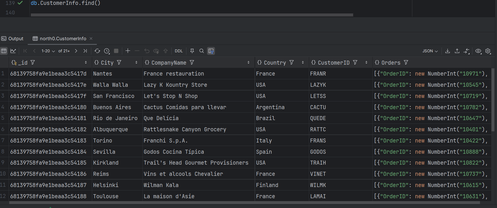
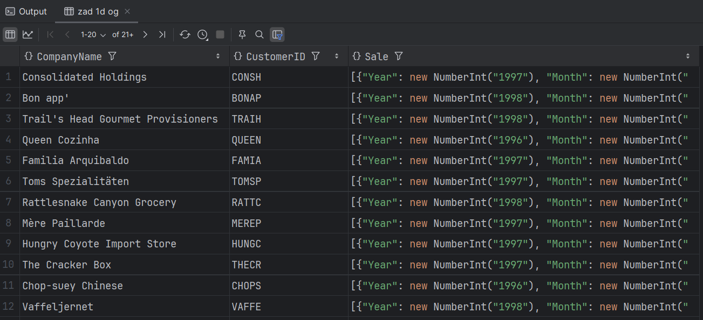
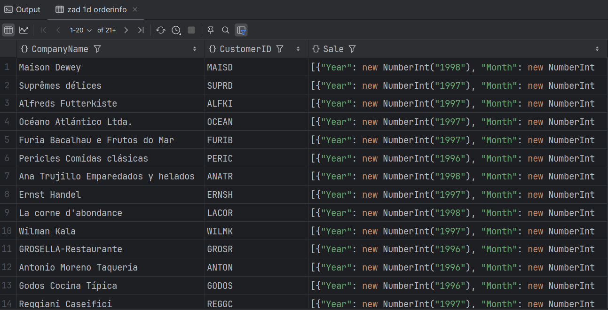
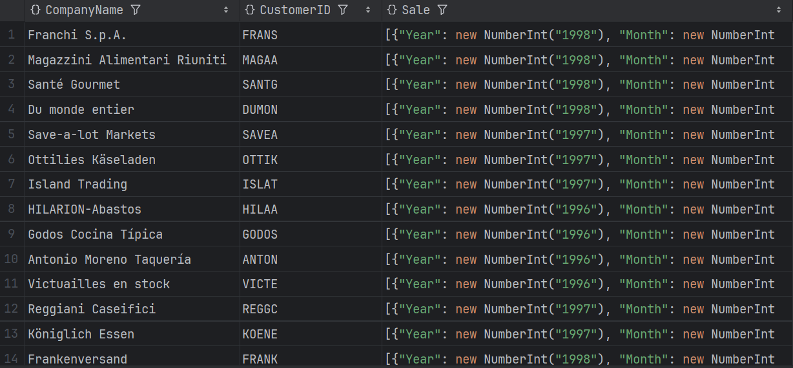

# Dokumentowe bazy danych – MongoDB

Ćwiczenie/zadanie

---

**Imiona i nazwiska autorów:**
**Filip Węgrzyn | Seweryn Tasior**

---

Odtwórz z backupu bazę north0

```
mongorestore --nsInclude='north0.*' ./dump/
```

```
use north0
```

# Zadanie 1 - operacje wyszukiwania danych, przetwarzanie dokumentów

# a)

stwórz kolekcję `OrdersInfo` zawierającą następujące dane o zamówieniach

- pojedynczy dokument opisuje jedno zamówienie

```js
[
  {
    "_id": ...

    OrderID": ... numer zamówienia

    "Customer": {  ... podstawowe informacje o kliencie skladającym
      "CustomerID": ... identyfikator klienta
      "CompanyName": ... nazwa klienta
      "City": ... miasto
      "Country": ... kraj
    },

    "Employee": {  ... podstawowe informacje o pracowniku obsługującym zamówienie
      "EmployeeID": ... idntyfikator pracownika
      "FirstName": ... imie
      "LastName": ... nazwisko
      "Title": ... stanowisko

    },

    "Dates": {
       "OrderDate": ... data złożenia zamówienia
       "RequiredDate": data wymaganej realizacji
    }

    "Orderdetails": [  ... pozycje/szczegóły zamówienia - tablica takich pozycji
      {
        "UnitPrice": ... cena
        "Quantity": ... liczba sprzedanych jednostek towaru
        "Discount": ... zniżka
        "Value": ... wartośc pozycji zamówienia
        "product": { ... podstawowe informacje o produkcie
          "ProductID": ... identyfikator produktu
          "ProductName": ... nazwa produktu
          "QuantityPerUnit": ... opis/opakowannie
          "CategoryID": ... identyfikator kategorii do której należy produkt
          "CategoryName" ... nazwę tej kategorii
        },
      },
      ...
    ],

    "Freight": ... opłata za przesyłkę
    "OrderTotal"  ... sumaryczna wartosc sprzedanych produktów

    "Shipment" : {  ... informacja o wysyłce
        "Shipper": { ... podstawowe inf o przewoźniku
           "ShipperID":
            "CompanyName":
        }
        ... inf o odbiorcy przesyłki
        "ShipName": ...
        "ShipAddress": ...
        "ShipCity": ...
        "ShipCountry": ...
    }
  }
]
```

# b)

stwórz kolekcję `CustomerInfo` zawierającą następujące dane kazdym klencie

- pojedynczy dokument opisuje jednego klienta

```js
[
  {
    "_id": ...

    "CustomerID": ... identyfikator klienta
    "CompanyName": ... nazwa klienta
    "City": ... miasto
    "Country": ... kraj

	"Orders": [ ... tablica zamówień klienta o strukturze takiej jak w punkcie a) (oczywiście bez informacji o kliencie)

	]


]
```

# c)

Napisz polecenie/zapytanie: Dla każdego klienta pokaż wartość zakupionych przez niego produktów z kategorii 'Confections' w 1997r

- Spróbuj napisać to zapytanie wykorzystując

  - oryginalne kolekcje (`customers, orders, orderdertails, products, categories`)
  - kolekcję `OrderInfo`
  - kolekcję `CustomerInfo`

- porównaj zapytania/polecenia/wyniki

```js
[
  {
    "_id":

    "CustomerID": ... identyfikator klienta
    "CompanyName": ... nazwa klienta
	"ConfectionsSale97": ... wartość zakupionych przez niego produktów z kategorii 'Confections'  w 1997r

  }
]
```

# d)

Napisz polecenie/zapytanie: Dla każdego klienta poaje wartość sprzedaży z podziałem na lata i miesiące
Spróbuj napisać to zapytanie wykorzystując - oryginalne kolekcje (`customers, orders, orderdertails, products, categories`) - kolekcję `OrderInfo` - kolekcję `CustomerInfo`

- porównaj zapytania/polecenia/wyniki

```js
[
  {
    "_id":

    "CustomerID": ... identyfikator klienta
    "CompanyName": ... nazwa klienta

	"Sale": [ ... tablica zawierająca inf o sprzedazy
	    {
            "Year":  ....
            "Month": ....
            "Total": ...
	    }
	    ...
	]
  }
]
```

# e)

Załóżmy że pojawia się nowe zamówienie dla klienta 'ALFKI', zawierające dwa produkty 'Chai' oraz "Ikura"

- pozostałe pola w zamówieniu (ceny, liczby sztuk prod, inf o przewoźniku itp. możesz uzupełnić wg własnego uznania)
  Napisz polecenie które dodaje takie zamówienie do bazy
- aktualizując oryginalne kolekcje `orders`, `orderdetails`
- aktualizując kolekcję `OrderInfo`
- aktualizując kolekcję `CustomerInfo`

Napisz polecenie

- aktualizując oryginalną kolekcję orderdetails`
- aktualizując kolekcję `OrderInfo`
- aktualizując kolekcję `CustomerInfo`

# f)

Napisz polecenie które modyfikuje zamówienie dodane w pkt e) zwiększając zniżkę o 5% (dla każdej pozycji tego zamówienia)

Napisz polecenie

- aktualizując oryginalną kolekcję `orderdetails`
- aktualizując kolekcję `OrderInfo`
- aktualizując kolekcję `CustomerInfo`

UWAGA:
W raporcie należy zamieścić kod poleceń oraz uzyskany rezultat, np wynik polecenia `db.kolekcka.fimd().limit(2)` lub jego fragment

## Zadanie 1 - rozwiązanie

> Wyniki:
>
> przykłady, kod, zrzuty ekranów, komentarz ...

a)

```js
--  ...
```

b)

```js
db.createCollection("CustomerInfo", {
  validator: {
    $jsonSchema: {
      bsonType: "object",
      required: ["CustomerID", "CompanyName", "City", "Country", "Orders"],
      properties: {
        CustomerID: {
          bsonType: "string",
          description: "string required",
        },
        CompanyName: {
          bsonType: "string",
          description: "string required",
        },
        City: {
          bsonType: "string",
          description: "string required",
        },
        Country: {
          bsonType: "string",
          description: "string required",
        },
        Orders: {
          bsonType: "array",
          description: "array required",
          items: {
            bsonType: "object",
            properties: {
              OrderID: {
                bsonType: "int",
                description: "int required",
              },
              Employee: {
                bsonType: "object",
                properties: {
                  EmployeeID: {
                    bsonType: "int",
                    description: "int required",
                  },
                  FirstName: {
                    bsonType: "string",
                    description: "string required",
                  },
                  LastName: {
                    bsonType: "string",
                    description: "string required",
                  },
                  Title: {
                    bsonType: "string",
                    description: "string required",
                  },
                },
              },
              Dates: {
                bsonType: "object",
                properties: {
                  OrderDate: {
                    bsonType: "date",
                    description: "date required",
                  },
                  RequiredDate: {
                    bsonType: "date",
                    description: "date required",
                  },
                },
              },
              Orderdetails: {
                bsonType: "array",
                items: {
                  bsonType: "object",
                  properties: {
                    UnitPrice: {
                      bsonType: "double",
                      description: "double required",
                    },
                    Quantity: {
                      bsonType: "int",
                      description: "int required",
                    },
                    Discount: {
                      bsonType: "double",
                      description: "double required",
                    },
                    Value: {
                      bsonType: "double",
                      description: "double required",
                    },
                    product: {
                      bsonType: "object",
                      properties: {
                        ProductID: {
                          bsonType: "int",
                          description: "int required",
                        },
                        ProductName: {
                          bsonType: "string",
                          description: "string required",
                        },
                        QuantityPerUnit: {
                          bsonType: "string",
                          description: "string required",
                        },
                        CategoryID: {
                          bsonType: "int",
                          description: "int required",
                        },
                        CategoryName: {
                          bsonType: "string",
                          description: "string required",
                        },
                      },
                    },
                  },
                },
              },
              Freight: {
                bsonType: "double",
                description: "double required",
              },
              OrderTotal: {
                bsonType: "double",
                description: "double required",
              },
              Shipment: {
                bsonType: "object",
                properties: {
                  Shipper: {
                    bsonType: "object",
                    properties: {
                      ShipperID: {
                        bsonType: "int",
                        description: "int required",
                      },
                      CompanyName: {
                        bsonType: "string",
                        description: "string required",
                      },
                    },
                  },
                  ShipName: {
                    bsonType: "string",
                    description: "string required",
                  },
                  ShipAddress: {
                    bsonType: "string",
                    description: "string required",
                  },
                  ShipCity: {
                    bsonType: "string",
                    description: "string required",
                  },
                  ShipCountry: {
                    bsonType: "string",
                    description: "string required",
                  },
                },
              },
            },
          },
        },
      },
    },
  },
});

db.customers.aggregate([
  {
    $lookup: {
      from: "OrdersInfo",
      localField: "CustomerID",
      foreignField: "Customer.CustomerID",
      as: "OrdersInfo",
    },
  },
  { $unwind: "$OrdersInfo" },

  {
    $group: {
      _id: "$CustomerID",
      CustomerID: { $first: "$CustomerID" },
      CompanyName: { $first: "$CompanyName" },
      City: { $first: "$City" },
      Country: { $first: "$Country" },
      Orders: {
        $push: {
          OrderID: "$OrdersInfo.OrderID",
          Dates: "$OrdersInfo.Dates",
          Employee: "$OrdersInfo.Employee",
          Freight: "$OrdersInfo.Freight",
          OrderTotal: "$OrdersInfo.OrderTotal",
          Shipment: "$OrdersInfo.Shipment",
          Orderdetails: "$OrdersInfo.Orderdetails",
        },
      },
    },
  },
  {
    $project: {
      _id: 0,
      CustomerID: 1,
      CompanyName: 1,
      City: 1,
      Country: 1,
      Orders: 1,
    },
  },

  {
    $merge: {
      into: "CustomerInfo",
    },
  },
]);
```


d)

```js
// zad 1d original
db.customers.aggregate([
  {
    $lookup: {
      from: "orders",
      localField: "CustomerID",
      foreignField: "CustomerID",
      as: "Orders",
    },
  },
  { $unwind: "$Orders" },
  {
    $lookup: {
      from: "orderdetails",
      localField: "Orders.OrderID",
      foreignField: "OrderID",
      as: "Orderdetails",
    },
  },
  { $unwind: "$Orderdetails" },
  {
    $group: {
      _id: {
        CustomerID: "$CustomerID",
        CompanyName: "$CompanyName",
        Year: { $year: "$Orders.OrderDate" },
        Month: { $month: "$Orders.OrderDate" },
      },
      Total: {
        $sum: {
          $multiply: [
            "$Orderdetails.UnitPrice",
            "$Orderdetails.Quantity",
            { $subtract: [1, "$Orderdetails.Discount"] },
          ],
        },
      },
    },
  },
  {
    $group: {
      _id: "$_id.CustomerID",
      CompanyName: { $first: "$_id.CompanyName" },
      Sale: {
        $push: {
          Year: "$_id.Year",
          Month: "$_id.Month",
          Total: "$Total",
        },
      },
    },
  },
  {
    $project: {
      _id: 0,
      CustomerID: "$_id",
      CompanyName: 1,
      Sale: 1,
    },
  },
]);
```



```js
//zad 1d orderinfo
db.OrdersInfo.aggregate([
  { $unwind: "$Orderdetails" },

  {
    $group: {
      _id: {
        CustomerID: "$Customer.CustomerID",
        CompanyName: "$Customer.CompanyName",
        Year: { $year: "$Dates.OrderDate" },
        Month: { $month: "$Dates.OrderDate" },
      },
      Total: { $sum: "$Orderdetails.Value" },
    },
  },

  {
    $group: {
      _id: "$_id.CustomerID",
      CompanyName: { $first: "$_id.CompanyName" },
      Sale: {
        $push: {
          Year: "$_id.Year",
          Month: "$_id.Month",
          Total: "$Total",
        },
      },
    },
  },

  {
    $project: {
      _id: 0,
      CustomerID: "$_id",
      CompanyName: 1,
      Sale: 1,
    },
  },
]);
```



```js
//zad1d customerinfo
db.CustomerInfo.aggregate([
  { $unwind: "$Orders" },
  { $unwind: "$Orders.Orderdetails" },
  {
    $group: {
      _id: {
        CustomerID: "$CustomerID",
        CompanyName: "$CompanyName",
        Year: { $year: "$Orders.Dates.OrderDate" },
        Month: { $month: "$Orders.Dates.OrderDate" },
      },
      Total: { $sum: "$Orders.Orderdetails.Value" },
    },
  },

  {
    $group: {
      _id: "$_id.CustomerID",
      CompanyName: { $first: "$_id.CompanyName" },
      Sale: {
        $push: {
          Year: "$_id.Year",
          Month: "$_id.Month",
          Total: "$Total",
        },
      },
    },
  },

  {
    $project: {
      _id: 0,
      CustomerID: "$_id",
      CompanyName: 1,
      Sale: 1,
    },
  },
]);
```


e)

```js
const newOrderId = 12345;

db.orders.insertOne({
  OrderID: newOrderId,
  CustomerID: "ALFKI",
  EmployeeID: 5,
  OrderDate: ISODate("2025-04-16T00:00:00Z"),
  RequiredDate: ISODate("2025-05-16T00:00:00Z"),
  ShipVia: 3,
  Freight: 15.0,
  ShipName: "Alfreds Futterkiste",
  ShipAddress: "Obere Str. 57",
  ShipCity: "Berlin",
  ShipCountry: "Germany",
});

db.orderdetails.insertMany([
  {
    OrderID: newOrderId,
    ProductID: 1,
    UnitPrice: 18.0,
    Quantity: 10,
    Discount: 0,
  },
  {
    OrderID: newOrderId,
    ProductID: 31,
    UnitPrice: 62.5,
    Quantity: 5,
    Discount: 0.05,
  },
]);

db.OrdersInfo.insertOne({
  OrderID: newOrderId,
  Customer: {
    CustomerID: "ALFKI",
    CompanyName: "Alfreds Futterkiste",
    City: "Berlin",
    Country: "Germany",
  },
  Employee: {
    EmployeeID: 5,
    FirstName: "Steven",
    LastName: "Buchanan",
    Title: "Sales Manager",
  },
  Dates: {
    OrderDate: ISODate("2025-04-16T00:00:00Z"),
    RequiredDate: ISODate("2025-05-16T00:00:00Z"),
  },
  Orderdetails: [
    {
      UnitPrice: 18.0,
      Quantity: 10,
      Discount: 0,
      Value: 180.0,
      product: {
        ProductID: 1,
        ProductName: "Chai",
        QuantityPerUnit: "10 boxes x 20 bags",
        CategoryID: 1,
        CategoryName: "Beverages",
      },
    },
    {
      UnitPrice: 62.5,
      Quantity: 5,
      Discount: 0.05,
      Value: 296.875,
      product: {
        ProductID: 31,
        ProductName: "Ikura",
        QuantityPerUnit: "12 - 200 g jars",
        CategoryID: 8,
        CategoryName: "Seafood",
      },
    },
  ],
  Freight: 15.0,
  OrderTotal: 476.875,
  Shipment: {
    Shipper: { ShipperID: 3, CompanyName: "Federal Shipping" },
    ShipName: "Alfreds Futterkiste",
    ShipAddress: "Obere Str. 57",
    ShipCity: "Berlin",
    ShipCountry: "Germany",
  },
});

db.CustomerInfo.updateOne(
  { CustomerID: "ALFKI" },
  {
    $push: {
      Orders: {
        OrderID: newOrderId,
        Dates: {
          OrderDate: ISODate("2025-04-16T00:00:00Z"),
          RequiredDate: ISODate("2025-05-16T00:00:00Z"),
        },
        Employee: {
          EmployeeID: 5,
          FirstName: "Steven",
          LastName: "Buchanan",
          Title: "Sales Manager",
        },
        Freight: 15.0,
        OrderTotal: 476.875,
        Shipment: {
          Shipper: { ShipperID: 3, CompanyName: "Federal Shipping" },
          ShipName: "Alfreds Futterkiste",
          ShipAddress: "Obere Str. 57",
          ShipCity: "Berlin",
          ShipCountry: "Germany",
        },
        Orderdetails: [
          {
            UnitPrice: 18.0,
            Quantity: 10,
            Discount: 0,
            Value: 180.0,
            product: {
              ProductID: 1,
              ProductName: "Chai",
              QuantityPerUnit: "10 boxes x 20 bags",
              CategoryID: 1,
              CategoryName: "Beverages",
            },
          },
          {
            UnitPrice: 62.5,
            Quantity: 5,
            Discount: 0.05,
            Value: 296.875,
            product: {
              ProductID: 31,
              ProductName: "Ikura",
              QuantityPerUnit: "12 - 200 g jars",
              CategoryID: 8,
              CategoryName: "Seafood",
            },
          },
        ],
      },
    },
  }
);
```

....

# Zadanie 2 - modelowanie danych

Zaproponuj strukturę bazy danych dla wybranego/przykładowego zagadnienia/problemu

Należy wybrać jedno zagadnienie/problem (A lub B lub C)

Przykład A

- Wykładowcy, przedmioty, studenci, oceny
  - Wykładowcy prowadzą zajęcia z poszczególnych przedmiotów
  - Studenci uczęszczają na zajęcia
  - Wykładowcy wystawiają oceny studentom
  - Studenci oceniają zajęcia

Przykład B

- Firmy, wycieczki, osoby
  - Firmy organizują wycieczki
  - Osoby rezerwują miejsca/wykupują bilety
  - Osoby oceniają wycieczki

Przykład C

- Własny przykład o podobnym stopniu złożoności

a) Zaproponuj różne warianty struktury bazy danych i dokumentów w poszczególnych kolekcjach oraz przeprowadzić dyskusję każdego wariantu (wskazać wady i zalety każdego z wariantów)

- zdefiniuj schemat/reguły walidacji danych
- wykorzystaj referencje
- dokumenty zagnieżdżone
- tablice

b) Kolekcje należy wypełnić przykładowymi danymi

c) W kontekście zaprezentowania wad/zalet należy zaprezentować kilka przykładów/zapytań/operacji oraz dla których dedykowany jest dany wariant

W sprawozdaniu należy zamieścić przykładowe dokumenty w formacie JSON ( pkt a) i b)), oraz kod zapytań/operacji (pkt c)), wraz z odpowiednim komentarzem opisującym strukturę dokumentów oraz polecenia ilustrujące wykonanie przykładowych operacji na danych

Do sprawozdania należy kompletny zrzut wykonanych/przygotowanych baz danych (taki zrzut można wykonać np. za pomocą poleceń `mongoexport`, `mongdump` …) oraz plik z kodem operacji/zapytań w wersji źródłowej (np. plik .js, np. plik .md ), załącznik powinien mieć format zip

## Zadanie 2 - rozwiązanie

> Wyniki:
>
> przykłady, kod, zrzuty ekranów, komentarz ...

### Postanowiliśmy przeanalizować 3 modele bazy danych.

**Model 1**  
Znormalizowane kolekcje bez redundancji danych i zagnieżdżeń

```js
// Company1
db.createCollection("Company1", {
  validator: {
    $jsonSchema: {
      bsonType: "object",
      required: ["name", "address"],
      properties: {
        _id: { bsonType: "objectId" },
        name: { bsonType: "string", description: "string required" },
        address: { bsonType: "string", description: "string required" },
      },
    },
  },
});

// Person1
db.createCollection("Person1", {
  validator: {
    $jsonSchema: {
      bsonType: "object",
      required: ["firstname", "lastname"],
      properties: {
        _id: { bsonType: "objectId" },
        firstname: { bsonType: "string", description: "string required" },
        lastname: { bsonType: "string", description: "string required" },
      },
    },
  },
});

// Trip1
db.createCollection("Trip1", {
  validator: {
    $jsonSchema: {
      bsonType: "object",
      required: ["name", "destination", "date", "max_places", "companyId"],
      properties: {
        _id: { bsonType: "objectId" },
        name: { bsonType: "string", description: "string required" },
        destination: { bsonType: "string", description: "string required" },
        date: { bsonType: "date", description: "date required" },
        max_places: {
          bsonType: "int",
          minimum: 1,
          description: "int>=1 required",
        },
        companyId: {
          bsonType: "objectId",
          description: "fkey to Company1._id",
        },
      },
    },
  },
});

// Rating1
db.createCollection("Rating1", {
  validator: {
    $jsonSchema: {
      bsonType: "object",
      required: ["tripId", "personId", "rating"],
      properties: {
        _id: { bsonType: "objectId" },
        tripId: { bsonType: "objectId", description: "fkey to Trip1._id" },
        personId: { bsonType: "objectId", description: "fkey to Person1._id" },
        rating: { bsonType: "int", minimum: 1, maximum: 5 },
      },
    },
  },
});

// Reservation1
db.createCollection("Reservation1", {
  validator: {
    $jsonSchema: {
      bsonType: "object",
      required: ["tripId", "personId", "no_tickets"],
      properties: {
        _id: { bsonType: "objectId" },
        tripId: { bsonType: "objectId", description: "fkey to Trip1._id" },
        personId: { bsonType: "objectId", description: "fkey to Person1._id" },
        no_tickets: { bsonType: "int", minimum: 1 },
      },
    },
  },
});
```

Wpisanie danych do modelu 1:

```js
// 2a) Firmy – każda pojedynczo, z odczytem insertedId
var resTravelCo  = db.Company1.insertOne({ name: "TravelCo",      address: "ul. Podróżnicza 10, Warszawa" });
var resAdventure = db.Company1.insertOne({ name: "AdventureTime", address: "ul. Wyprawowa 5, Kraków" });
var compTravelCoId  = resTravelCo.insertedId;
var compAdventureId = resAdventure.insertedId;


// 2b) Wycieczki – każda pojedynczo, z odczytem insertedId
var resMazury = db.Trip1.insertOne({
  name:        "Mazury Tour",
  destination: "Mazury",
  date:        ISODate("2025-03-10"),
  max_places:  20,
  companyId:   compTravelCoId
});
var resTatry = db.Trip1.insertOne({
  name:        "Tatry Hike",
  destination: "Tatry",
  date:        ISODate("2025-07-15"),
  max_places:  15,
  companyId:   compTravelCoId
});
var resCity = db.Trip1.insertOne({
  name:        "City Break",
  destination: "Wrocław",
  date:        ISODate("2025-05-20"),
  max_places:  25,
  companyId:   compAdventureId
});
var tripMazuryId = resMazury.insertedId;
var tripTatryId  = resTatry.insertedId;
var tripCityId   = resCity.insertedId;


// 2c) Osoby – każda pojedynczo lub grupowo, ale potem rozbijamy wyniki
// Tu możemy użyć insertMany, ale i tak zrobimy extract na każdy index
var resAnna  = db.Person1.insertOne({ firstname: "Anna",  lastname: "Kowalska" });
var resPiotr = db.Person1.insertOne({ firstname: "Piotr", lastname: "Nowak" });
var resEwa   = db.Person1.insertOne({ firstname: "Ewa",   lastname: "Wiśniewska" });

var persAnnaId  = resAnna.insertedId;
var persPiotrId = resPiotr.insertedId;
var persEwaId   = resEwa.insertedId;


// 2d) Oceny
db.Rating1.insertMany([
  { tripId: tripMazuryId, personId: persAnnaId,  rating: 5 },
  { tripId: tripMazuryId, personId: persPiotrId, rating: 4 }
]);


// 2e) Rezerwacje
db.Reservation1.insertMany([
  { tripId: tripMazuryId, personId: persAnnaId,  no_tickets: 2 },
  { tripId: tripTatryId,  personId: persPiotrId, no_tickets: 1 }
]);
```

**Model 3**

Zagnieżdżone tablice wewnątrz oryginalnych kolekcji

```js
// 1. Company3 – firmy z zagnieżdżonymi wycieczkami
db.createCollection("Company3", {
  validator: {
    $jsonSchema: {
      bsonType: "object",
      required: ["name", "address", "trips"],
      properties: {
        _id: { bsonType: "objectId" },
        name: {
          bsonType: "string",
          description: "must be string and is required",
        },
        address: {
          bsonType: "string",
          description: "must be string and is required",
        },
        trips: {
          bsonType: "array",
          items: {
            bsonType: "object",
            required: ["name", "destination", "date", "max_places", "tripId"],
            properties: {
              tripId: {
                bsonType: "objectId",
                description: "fkey to Trip3._id",
              },
              name: { bsonType: "string" },
              destination: { bsonType: "string" },
              date: { bsonType: "date" },
              max_places: { bsonType: "int", minimum: 1 },
            },
          },
        },
      },
    },
  },
});

// 2. Trip3 – wycieczki z zagnieżdżonymi ocenami
db.createCollection("Trip3", {
  validator: {
    $jsonSchema: {
      bsonType: "object",
      required: [
        "name",
        "destination",
        "date",
        "max_places",
        "companyId",
        "ratings",
      ],
      properties: {
        _id: { bsonType: "objectId" },
        name: { bsonType: "string" },
        destination: { bsonType: "string" },
        date: { bsonType: "date" },
        max_places: { bsonType: "int", minimum: 1 },
        companyId: {
          bsonType: "objectId",
          description: "fkey to Company3._id",
        },
        available_places: { bsonType: "int" },
        number_of_ratings: { bsonType: "int" },
        average_rating: { bsonType: "decimal" },
        ratings: {
          bsonType: "array",
          items: {
            bsonType: "object",
            required: ["personId", "rating", "firstname", "lastname"],
            properties: {
              personId: {
                bsonType: "objectId",
                description: "fkey to Person3._id",
              },
              firstname: { bsonType: "string" },
              lastname: { bsonType: "string" },
              rating: { bsonType: "int", minimum: 1, maximum: 5 },
            },
          },
        },
      },
    },
  },
});

// 3. Person3 – osoby z zagnieżdżonymi rezerwacjami

db.createCollection("Person3", {
  validator: {
    $jsonSchema: {
      bsonType: "object",
      required: ["firstname", "lastname", "reservations"],
      properties: {
        _id: { bsonType: "objectId" },
        firstname: { bsonType: "string" },
        lastname: { bsonType: "string" },
        reservations: {
          bsonType: "array",
          items: {
            bsonType: "object",
            required: [
              "tripId",
              "reservationId",
              "no_tickets",
              "name",
              "destination",
              "date",
              "companyId",
              "companyName",
            ],
            properties: {
              name: { bsonType: "string" },
              destination: { bsonType: "string" },
              date: { bsonType: "date" },
              no_tickets: { bsonType: "int", minimum: 1 },
              rating: { bsonType: ["int", "null"], minimum: 1, maximum: 5 },
              companyName: { bsonType: "string" },
              tripId: {
                bsonType: "objectId",
                description: "fkey to Trip3._id",
              },
              reservationId: {
                bsonType: "objectId",
                description: "fkey to Reservation3._id",
              },
              companyId: {
                bsonType: "objectId",
                description: "fkey to Company3._id",
              },
            },
          },
        },
      },
    },
  },
});

// 4. Reservation3 – osobna kolekcja rezerwacji

db.createCollection("Reservation3", {
  validator: {
    $jsonSchema: {
      bsonType: "object",
      required: ["personId", "tripId", "no_tickets"],
      properties: {
        _id: { bsonType: "objectId" },
        personId: { bsonType: "objectId", description: "fkey to Person3._id" },
        tripId: { bsonType: "objectId", description: "fkey to Trip3._id" },
        no_tickets: { bsonType: "int", minimum: 1 },
      },
    },
  },
});
```

Wpisanie danych do modelu 3:

```js
// — 2a) Wstawiamy firmy 

var resTravelCo  = db.Company3.insertOne({
  name:    "TravelCo",
  address: "ul. Podróżnicza 10, Warszawa",
  trips:   []
});
var comp1Id = resTravelCo.insertedId;

var resAdventure = db.Company3.insertOne({
  name:    "AdventureTime",
  address: "ul. Wyprawowa 5, Kraków",
  trips:   []
});
var comp2Id = resAdventure.insertedId;


// — 2b) Wstawiamy wycieczki do Trip3

var resMazury = db.Trip3.insertOne({
  name:         "Mazury Tour",
  destination:  "Mazury",
  date:         ISODate("2025-03-10"),
  max_places:   20,
  companyId:    comp1Id,
  available_places: 20,
  number_of_ratings: 0,
  average_rating:   NumberDecimal("0"),
  ratings:      []
});
var trip1Id = resMazury.insertedId;

var resTatry = db.Trip3.insertOne({
  name:         "Tatry Hike",
  destination:  "Tatry",
  date:         ISODate("2025-07-15"),
  max_places:   15,
  companyId:    comp1Id,
  available_places: 15,
  number_of_ratings: 0,
  average_rating:   NumberDecimal("0"),
  ratings:      []
});
var trip2Id = resTatry.insertedId;

var resCity = db.Trip3.insertOne({
  name:         "City Break",
  destination:  "Wrocław",
  date:         ISODate("2025-05-20"),
  max_places:   25,
  companyId:    comp2Id,
  available_places: 25,
  number_of_ratings: 0,
  average_rating:   NumberDecimal("0"),
  ratings:      []
});
var trip3Id = resCity.insertedId;


// — 2c) Uaktualniamy Company3.trips 

db.Company3.updateOne(
  { _id: comp1Id },
  { $set: {
      trips: [
        {
          tripId:      trip1Id,
          name:        "Mazury Tour",
          destination: "Mazury",
          date:        ISODate("2025-03-10"),
          max_places:  20
        },
        {
          tripId:      trip2Id,
          name:        "Tatry Hike",
          destination: "Tatry",
          date:        ISODate("2025-07-15"),
          max_places:  15
        }
      ]
  }}
);

db.Company3.updateOne(
  { _id: comp2Id },
  { $set: {
      trips: [
        {
          tripId:      trip3Id,
          name:        "City Break",
          destination: "Wrocław",
          date:        ISODate("2025-05-20"),
          max_places:  25
        }
      ]
  }}
);


// — 2d) Wstawiamy osoby do Person3

var resAnna  = db.Person3.insertOne({ firstname: "Anna",  lastname: "Kowalska",   reservations: [] });
var p1Id     = resAnna.insertedId;
var resPiotr = db.Person3.insertOne({ firstname: "Piotr", lastname: "Nowak",      reservations: [] });
var p2Id     = resPiotr.insertedId;
var resEwa   = db.Person3.insertOne({ firstname: "Ewa",   lastname: "Wiśniewska", reservations: [] });
var p3Id     = resEwa.insertedId;


// — 2e) Rezerwacje

var r1 = db.Reservation3.insertOne({ personId: p1Id, tripId: trip1Id, no_tickets: 2 }).insertedId;
db.Person3.updateOne(
  { _id: p1Id },
  { $push: {
      reservations: {
        reservationId: r1,
        tripId:        trip1Id,
        name:          "Mazury Tour",
        destination:   "Mazury",
        date:          ISODate("2025-03-10"),
        no_tickets:    2,
        rating:        null,
        companyId:     comp1Id,
        companyName:   "TravelCo"
      }
  }}
);

var r2 = db.Reservation3.insertOne({ personId: p2Id, tripId: trip1Id, no_tickets: 1 }).insertedId;
db.Person3.updateOne(
  { _id: p2Id },
  { $push: {
      reservations: {
        reservationId: r2,
        tripId:        trip1Id,
        name:          "Mazury Tour",
        destination:   "Mazury",
        date:          ISODate("2025-03-10"),
        no_tickets:    1,
        rating:        null,
        companyId:     comp1Id,
        companyName:   "TravelCo"
      }
  }}
);


// — 2f) Oceny na Trip3: updateOne z $push i $each —

db.Trip3.updateOne(
  { _id: trip1Id },
  {
    $push: {
      ratings: {
        $each: [
          {
            personId:  p1Id,
            firstname: "Anna",
            lastname:  "Kowalska",
            rating:    5
          },
          {
            personId:  p2Id,
            firstname: "Piotr",
            lastname:  "Nowak",
            rating:    4
          }
        ]
      }
    },
    $set: {
      average_rating: NumberDecimal(4.5),
      number_of_ratings: 2
    }
  }
);
```

**Porównanie operacji dla modelu 1 i 3**

```js
// 1.1. Pobranie wszystkich wycieczek dla firmy o _id = comp1Id (Model1 - znormalizowany)
const comp1Id = db.Company1.findOne()._id;
db.Company1.aggregate([
  { $match: { _id: comp1Id } },
  {
    $lookup: {
      from: "Trip1",
      localField: "_id",
      foreignField: "companyId",
      as: "trips",
    },
  },
]);

// 3.1. Pobranie wszystkich wycieczek dla firmy o _id = comp3Id (Model3 - zagnieżdżony)
const comp3Id = db.Company3.findOne()._id;
db.Company3.findOne({ _id: comp3Id }, { _id: 0, name: 1, trips: 1 });

// 1.2. Pobranie informacji o rezerwacjach osoby (_id = person1Id) wraz z danymi o wycieczkach i ocenach (Model1)
const person1Id = db.Person1.findOne()._id;
db.Person1.aggregate([
  { $match: { _id: person1Id } },
  {
    $lookup: {
      from: "Reservation1",
      localField: "_id",
      foreignField: "personId",
      as: "reservations",
    },
  },
  { $unwind: "$reservations" },
  {
    $lookup: {
      from: "Trip1",
      localField: "reservations.tripId",
      foreignField: "_id",
      as: "trip",
    },
  },
  { $unwind: "$trip" },
  {
    $lookup: {
      from: "Rating1",
      let: { tid: "$trip._id", pid: "$ _id" },
      pipeline: [
        {
          $match: {
            $expr: {
              $and: [
                { $eq: ["$tripId", "$$tid"] },
                { $eq: ["$personId", "$$pid"] },
              ],
            },
          },
        },
      ],
      as: "rating",
    },
  },
  {
    $project: {
      _id: 0,
      firstname: 1,
      lastname: 1,
      trip_details: {
        tripId: "$trip._id",
        name: "$trip.name",
        destination: "$trip.destination",
        date: "$trip.date",
        no_tickets: "$reservations.no_tickets",
        rating: { $arrayElemAt: ["$rating.rating", 0] },
      },
    },
  },
]);

// 3.2. Pobranie informacji o rezerwacjach osoby (_id = person3Id) wraz z danymi o wycieczkach (Model3)
const person3Id = db.Person3.findOne()._id;
db.Person3.findOne(
  { _id: person3Id },
  { _id: 0, firstname: 1, lastname: 1, reservations: 1 }
);

// 1.3. Dodanie nowej rezerwacji (Model1)
const trip1Id = db.Trip1.findOne()._id;
const newRes = db.Reservation1.insertOne({
  personId: person1Id,
  tripId: trip1Id,
  no_tickets: 2,
});

// 3.3. Dodanie nowej rezerwacji (Model3):
// a) do kolekcji rezerwacji
const trip3Id = db.Trip3.findOne()._id;
const res3 = db.Reservation3.insertOne({
  personId: person1Id,
  tripId: trip3Id,
  no_tickets: 2,
});
// b) aktualizacja Person3.reservations
const tripInfo = db.Trip3.findOne({ _id: trip3Id });
const compInfo = db.Company3.findOne({ _id: tripInfo.companyId });

db.Person3.updateOne(
  { _id: person1Id },
  {
    $push: {
      reservations: {
        reservationId: res3.insertedId,
        tripId: tripInfo._id,
        name: tripInfo.name,
        destination: tripInfo.destination,
        date: tripInfo.date,
        no_tickets: 2,
        rating: null,
        companyId: tripInfo.companyId,
        companyName: compInfo.name,
      },
    },
  }
);

// c) aktualizacja available_places w Trip3
const allRes = db.Reservation3.find({ tripId: tripInfo._id }).toArray();
let totalTickets = 0;
for (let r of allRes) {
  totalTickets += r.no_tickets;
}

db.Trip3.updateOne(
  { _id: tripInfo._id },
  { $set: { available_places: tripInfo.max_places - totalTickets } }
);

// 1.4. Zmiana liczby biletów w rezerwacji (Model1)
db.Reservation1.updateOne(
  { _id: newRes.insertedId },
  { $set: { no_tickets: 3 } }
);

// 3.4. Zmiana liczby biletów w rezerwacji (Model3)
db.Reservation3.updateOne(
  { _id: res3.insertedId },
  { $set: { no_tickets: 3 } }
);
// Aktualizacja zagnieżdżonego reservation w Person3:
db.Person3.updateOne(
  { _id: person1, "reservations.reservationId": res3.insertedId },
  { $set: { "reservations.$.no_tickets": 3 } }
);

// 1.5. Obliczenie średniej oceny dla wycieczki (Model1)
db.Rating1.aggregate([
  { $match: { tripId: trip1Id } },
  { $group: { _id: "$tripId", avg_rating: { $avg: "$rating" } } },
]);

// 3.5. Pobranie average_rating z Trip3 (Model3)
db.Trip3.findOne({ _id: trip3Id }, { _id: 0, name: 1, average_rating: 1 });

// 1.6. Wyszukiwanie wycieczek według kryteriów (Model1)
db.Trip1.find({ destination: "Mazury", date: { $gte: ISODate("2025-01-01") } });

// 3.6. Wyszukiwanie (Model3)
db.Trip3.find({ destination: "Mazury", date: { $gte: ISODate("2025-01-01") } });
// lub w Company3:
db.Company3.find({
  "trips.destination": "Mazury",
  "trips.date": { $gte: ISODate("2025-01-01") },
});

// 1.7. Aktualizacja firmy (Model1)
db.Company1.updateOne(
  { _id: comp1Id },
  { $set: { address: "ul. Nowa 15, Warszawa" } }
);
// 3.7. Aktualizacja firmy (Model3)
db.Company3.updateOne(
  { _id: comp1Id },
  { $set: { address: "ul. Nowa 15, Warszawa" } }
);

// 1.8. Wyszukiwanie osób, które zarezerwowały konkretne tripId (Model1)
db.Person1.aggregate([
  {
    $lookup: {
      from: "Reservation1",
      localField: "_id",
      foreignField: "personId",
      as: "reservations",
    },
  },
  { $match: { "reservations.tripId": trip1Id } },
  { $project: { _id: 0, firstname: 1, lastname: 1 } },
]);

// 3.8. Wyszukiwanie osób (Model3)
db.Person3.find(
  { "reservations.tripId": trip3Id },
  { _id: 0, firstname: 1, lastname: 1 }
);
```

---

Punktacja:

|         |     |
| ------- | --- |
| zadanie | pkt |
| 1       | 1   |
| 2       | 1   |
| razem   | 2   |
