# Raport - Entity Framework

Ćwiczenie/zadanie

---
**Autorzy: Seweryn Tasior, Filip Węgrzyn** 
---
## a)
 - ProdContext.cs
    ```csharp
    using Microsoft.EntityFrameworkCore;
    public class ProdContext : DbContext
    {
        public DbSet<Product> Products { get; set; }
        public DbSet<Supplier> Suppliers { get; set; } 
        protected override void OnConfiguring(DbContextOptionsBuilder optionsBuilder)
        {
            base.OnConfiguring(optionsBuilder);
            optionsBuilder.UseSqlite("Datasource=MyProductDatabase");
        }
    }
    ```
 - Product.cs
    ```csharp
        public class Product
        {
            public int ProductID { get; set; }
            public String? ProductName { get; set; }
            public int UnitsInStock { get; set; }

            public int? SupplierID { get; set; }
            public Supplier? Supplier { get; set; }
        }
    ```
  - Supplier.cs
    ```csharp
        using System.Collections.ObjectModel;

        public class Supplier
        {
            public int SupplierID { get; set; }
            public String? CompanyName { get; set; }
            public String? Street { get; set; }
            public String? City { get; set; }

        }
    ```
 - Program.cs
    ```csharp
        using System;
        using Microsoft.EntityFrameworkCore;
        ProdContext context = new ProdContext();
        //Tworzenie supplliera
        Supplier supplier = new Supplier { CompanyName = "Okta", Street="Krola Augusta",City="Krakow" };
        //Przypisanie produktu do dostawcy
        context.Suppliers.Add(supplier);
        //Wyszukiwanie produktu
        var query2 = from prod in context.Products
                    where prod.ProductName == "kredki"
                    select prod;
        foreach (Product product in query2)
        {
            Console.WriteLine(product.ProductName);
            product.Supplier = supplier;
        }
        context.SaveChanges();
    ```
 - Następnie zostały wykonane komendy `dotnet build` i `dotnet run`
 - Products schema
    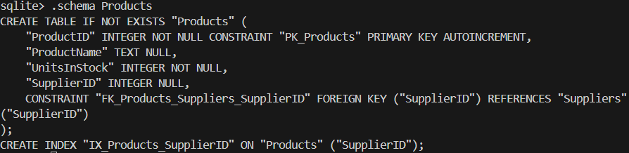
 - Suppliers schema
    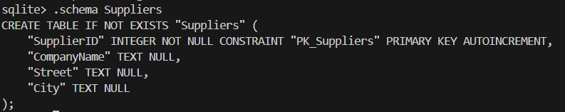
 - Zawartość tabeli Products
    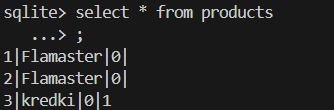
 - Zawartość tabeli Suppliers
    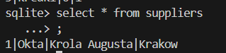
## b)
 - Product.cs
    ```csharp
        public class Product
        {
            public int ProductID { get; set; }
            public String? ProductName { get; set; }
            public int UnitsInStock { get; set; }
            
        }
    ```
  - Supplier.cs
    ```csharp
        using System.Collections.ObjectModel;

        public class Supplier
        {
            public int SupplierID { get; set; }
            public String? CompanyName { get; set; }
            public String? Street { get; set; }
            public String? City { get; set; }
            public ICollection<Product>? Products { get; set; }
        }
    ```
 - Program.cs
    ```csharp
        using System;
        using Microsoft.EntityFrameworkCore;

        ProdContext context = new ProdContext();

        //Tworzenie kilka produktów
        Product p1 = new Product { ProductName  = "Pilka", UnitsInStock =10 };
        Product p2 = new Product { ProductName  = "Deska", UnitsInStock =2 };
        Product p3 = new Product { ProductName  = "Kubek", UnitsInStock =4 };

        // Dodanie produktów do tabeli Products
        context.Products.Add(p1);
        context.Products.Add(p2);
        context.Products.Add(p3);
        context.SaveChanges();

        // Wyszukanie dostawcy
        var supplier = context.Suppliers
            .Where(s => s.CompanyName == "Okta")
            .FirstOrDefault();
        if (supplier == null)
            return;
        if (supplier.Products == null)
            supplier.Products = new List<Product>();

        // Dodanie produktów do dostawcy
        supplier.Products.Add(p1);
        supplier.Products.Add(p2);
        supplier.Products.Add(p3);

        context.SaveChanges();
    ```
 - Następnie zostały wykonane komendy `dotnet build` i `dotnet run`
 - Products schema
    
 - Suppliers schema
    
 - Zawartość tabeli Products i Suppliers
    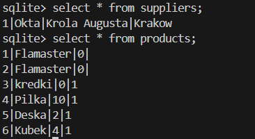
## c)
 - Product.cs
    ```csharp
        public class Product
        {
            public int ProductID { get; set; }
            public String? ProductName { get; set; }
            public int UnitsInStock { get; set; }
            public int? SupplierID { get; set; }
            public Supplier? Supplier { get; set; }
        }
    ```
  - Supplier.cs
    ```csharp
        using System.Collections.ObjectModel;

        public class Supplier
        {
            public int SupplierID { get; set; }
            public String? CompanyName { get; set; }
            public String? Street { get; set; }
            public String? City { get; set; }
            public ICollection<Product>? Products { get; set; }
        }
    ```
 - Program.cs
    ```csharp
        using System;
        using Microsoft.EntityFrameworkCore;

        ProdContext context = new ProdContext();

        //Tworzenie kilku produktów
        Product p3 = new Product { ProductName  = "Hak", UnitsInStock =11 };
        Product p4 = new Product { ProductName  = "Skakanka", UnitsInStock =9 };
        Product p5 = new Product { ProductName  = "Balon", UnitsInStock =20 };

        // Dodanie produktów do tabeli Products
        context.Products.Add(p3);
        context.Products.Add(p4);
        context.Products.Add(p5);
        context.SaveChanges();

        // Wyszukanie dostawcy
        var supplier = context.Suppliers
            .Where(s => s.CompanyName == "Okta")
            .FirstOrDefault();
        if (supplier == null)
            return;
        if (supplier.Products == null)
            supplier.Products = new List<Product>();

        // Dodanie produktów do dostawcy
        supplier.Products.Add(p3);
        supplier.Products.Add(p4);
        supplier.Products.Add(p5);

        // Dodanie suppliera do produktów
        p3.Supplier = supplier;
        p4.Supplier = supplier;
        p5.Supplier = supplier;

        context.SaveChanges();
    ```
 - Następnie zostały wykonane komendy `dotnet build` i `dotnet run`
 - Products schema
    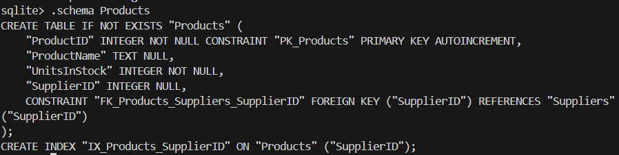
 - Suppliers schema
    
 - Zawartość tabeli Products i Suppliers
    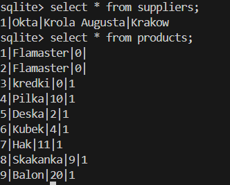
## d)
 - Product.cs
    ```csharp
        using System.Collections.ObjectModel;
        public class Product
        {
            public Product(){   
                this.Invoices = new HashSet<Invoice>();
            }
            public int ProductID { get; set; }
            public String? ProductName { get; set; }
            public int UnitsInStock { get; set; }

            public int? SupplierID { get; set; }
            public Supplier? Supplier { get; set; }

            public virtual ICollection<Invoice>? Invoices { get; set; }
        }
    ```
  - Invoice.cs
    ```csharp
        using System.Collections.ObjectModel;

        public class Invoice
        {
            public Invoice(){
                this.Products = new HashSet<Product>();
            }
            public int InvoiceID { get; set; }
            public int? InvoiceNumber { get; set; }
            public int? Quantity { get; set; }

            public virtual ICollection<Product>? Products { get; set; }
        }
    ```
 - Program.cs
    ```csharp
        using System;
        using Microsoft.EntityFrameworkCore;

        if (File.Exists("MyProductDatabase"))
        {
            File.Delete("MyProductDatabase");
            Console.WriteLine("Stara baza danych usunięta.");
        }

        ProdContext context = new ProdContext();
        context.Database.EnsureCreated();

        // Tworzenie kilku produktów
        Product p1 = new Product { ProductName = "Wiosla", UnitsInStock = 8 };
        Product p2 = new Product { ProductName = "Szklanka", UnitsInStock = 21 };
        Product p3 = new Product { ProductName = "Karton", UnitsInStock = 23 };
        Product p4 = new Product { ProductName = "Zeszyt", UnitsInStock = 12 };

        // Dodanie produktów do tabeli Products
        context.Products.AddRange(p1, p2, p3, p4);
        context.SaveChanges();

        // Tworzenie kilku faktur
        Invoice i1 = new Invoice { InvoiceNumber = 342, Quantity = 3 };
        Invoice i2 = new Invoice { InvoiceNumber = 654, Quantity = 5 };
        Invoice i3 = new Invoice { InvoiceNumber = 111, Quantity = 6 };

        i1.Products = new List<Product>();
        i2.Products = new List<Product>();
        i3.Products = new List<Product>();

        p1.Invoices = new List<Invoice>();
        p2.Invoices = new List<Invoice>();
        p3.Invoices = new List<Invoice>();
        p4.Invoices = new List<Invoice>();

        // Dodanie faktur do tabeli Invoices
        context.Invoices.AddRange(i1, i2, i3);
        context.SaveChanges();

        // Sprzedaż produktów - przypisanie ich do faktur
        // Faktura 1 
        i1.Products.Add(p1); 
        i1.Products.Add(p2);
        p1.Invoices.Add(i1);
        p2.Invoices.Add(i1);

        // Faktura 2 
        i2.Products.Add(p3); 
        p3.Invoices.Add(i2);

        // Faktura 3 
        i3.Products.Add(p3); 
        i3.Products.Add(p4);
        p3.Invoices.Add(i3);
        p4.Invoices.Add(i3);

        // Zapisanie relacji
        context.SaveChanges();

        // Wyświetlenie produktów na fakturach
        Console.WriteLine("\nZawartość faktur:");

        var invoices = context.Invoices
            .Include(i => i.Products)
            .ToList();

        foreach (var invoice in invoices)
        {
            Console.WriteLine($"Faktura nr {invoice.InvoiceNumber} (ID: {invoice.InvoiceID}):");
            if (invoice.Products != null)
            {
                foreach (var product in invoice.Products)
                {
                    Console.WriteLine($" - {product.ProductName} (na stanie: {product.UnitsInStock})");
                }
            }
            Console.WriteLine();
        }

        // Wyświetlenie faktur dla produktów
        Console.WriteLine("\nFaktury dla poszczególnych produktów:");

        var products = context.Products
            .Include(p => p.Invoices)
            .ToList();

        foreach (var product in products)
        {
            Console.WriteLine($"Produkt: {product.ProductName}");
            if (product.Invoices != null && product.Invoices.Any())
            {
                Console.WriteLine("Sprzedany na fakturach:");
                foreach (var inv in product.Invoices)
                {
                    Console.WriteLine($" - Faktura nr {inv.InvoiceNumber}");
                }
            }
            else
            {
                Console.WriteLine("Nie został jeszcze sprzedany.");
            }
            Console.WriteLine();
        }

        context.SaveChanges();
    ```
 - Następnie zostały wykonane komendy `dotnet build` i `dotnet run`. Wynik poniżej:
    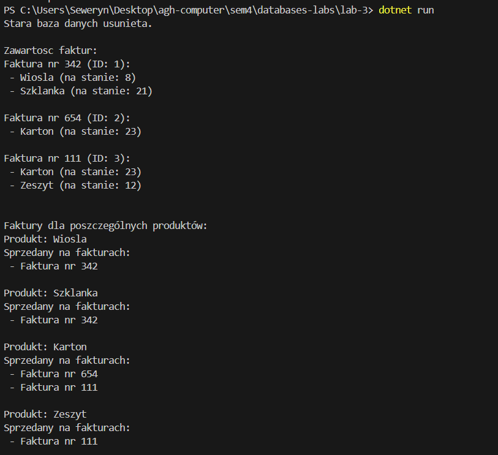
 - Products i Invoices schemas
    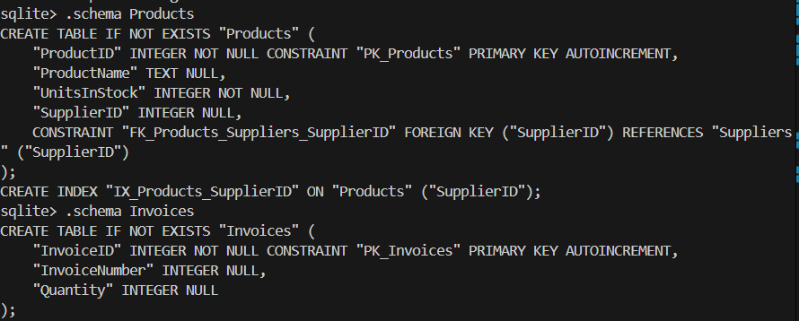
 - InvoiceProduct schema
    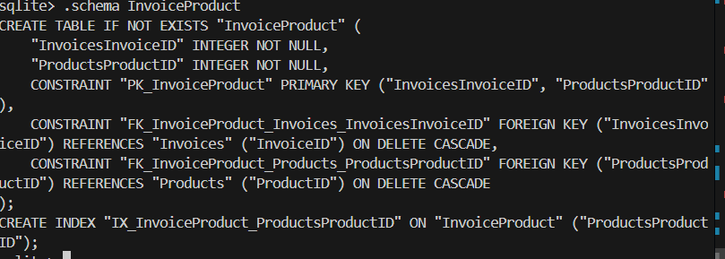
 - Zawartość tabeli Products i Invoices
    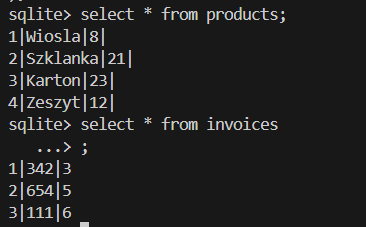
 - Zawartość tabeli InvoiceProduct
    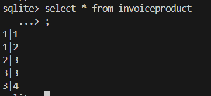
## e)
 - ProdContext.cs
    ```csharp
    using Microsoft.EntityFrameworkCore;
    public class ProdContext : DbContext
    {
        public DbSet<Company> Companies { get; set; }
        public DbSet<Supplier> Suppliers { get; set; }
        public DbSet<Customer> Customers { get; set; }
        public DbSet<Product> Products { get; set; }
        public DbSet<Invoice> Invoices { get; set; }
        
        protected override void OnConfiguring(DbContextOptionsBuilder optionsBuilder)
        {
            optionsBuilder.UseSqlite("Data Source=MyProductDatabase");
        }
        
        protected override void OnModelCreating(ModelBuilder modelBuilder)
        {
            modelBuilder.Entity<Company>()
                .HasDiscriminator<string>("CompanyType")
                .HasValue<Supplier>("Supplier")
                .HasValue<Customer>("Customer");
        }
    }
    ```
 - Company.cs
    ```csharp
        using System.Collections.ObjectModel;

        public abstract class Company
        {
            public int CompanyID { get; set; }
            public string? CompanyName { get; set; }
            public string? Street { get; set; }    
            public string? City { get; set; }
            public string? ZipCode { get; set; } 

            // Pole do identyfikacji typu
            public string CompanyType { get; set; }   
        }
    ```
 - Customer.cs
    ```csharp
        using System.Collections.ObjectModel;

        public class Customer : Company
        {
            public int? Discount { get; set; }

            public Customer()
            {
                CompanyType = "Customer";
            }
        }
    ```
 - Supplier.cs
    ```csharp
       using System.Collections.ObjectModel;
        public class Supplier : Company
        {
            public string? BankAccountNumber { get; set; }
            
            public Supplier()
            {
                CompanyType = "Supplier";
            }
        }
    ```
 - Program.cs
    ```csharp
        if (File.Exists("MyProductDatabase"))
        {
            File.Delete("MyProductDatabase");
            Console.WriteLine("Stara baza danych usunięta.");
        }

        // Inicjalizacja
        ProdContext context = new ProdContext();
        context.Database.EnsureCreated();
        Console.WriteLine("Utworzono bazę danych z hierarchią dziedziczenia.");

        // Tworzenie dostawcy
        Supplier supplier = new Supplier
        {
            CompanyName = "Biuromat",
            Street = "Długa 15",
            City = "Warszawa",
            ZipCode = "01-234",
            BankAccountNumber = "PL12345678901234567890123456"
        };
        Supplier supplier2 = new Supplier
        {
            CompanyName = "WilkoPol",
            Street = "Polna 15",
            City = "Koszalin",
            ZipCode = "23-41",
            BankAccountNumber = "PL2134343434113"
        };
        context.Suppliers.Add(supplier);
        context.Suppliers.Add(supplier2);

        // Tworzenie klienta
        Customer customer = new Customer
        {
            CompanyName = "AGH",
            Street = "Al. Mickiewicza 30",
            City = "Kraków",
            ZipCode = "30-059",
            Discount = 10
        };
        Customer customer2 = new Customer
        {
            CompanyName = "Deloitte",
            Street = "Al. Jana Pawła II 22",
            City = "Kraków",
            ZipCode = "32-259",
            Discount = 12
        };
        context.Customers.Add(customer);
        context.Customers.Add(customer2);
        context.SaveChanges();

        // Wyświetlenie wszystkich firm
        Console.WriteLine("\nWszystkie firmy:");
        var companies = context.Companies.ToList();
        foreach (var company in companies)
        {
            Console.WriteLine($"ID: {company.CompanyID}, Nazwa: {company.CompanyName}, Typ: {company.CompanyType}, Miasto: {company.City}");
        }
    ```

 - Następnie zostały wykonane komendy `dotnet build` i `dotnet run`. Wynik poniżej:
    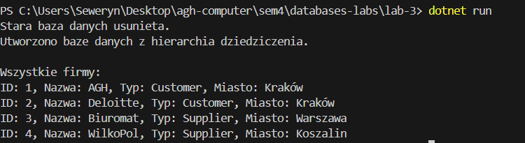
 - Companies schema
    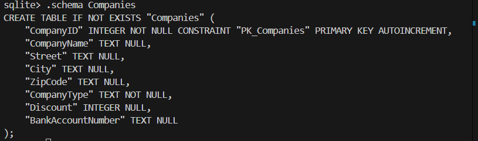
 - Zawartość tabeli Companies
    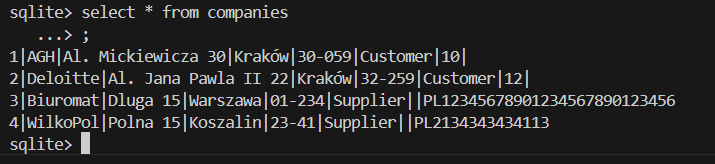
## f)
 - ProdContext.cs
    ```csharp
    using Microsoft.EntityFrameworkCore;
    public class ProdContext : DbContext
    {
        ...
        
        protected override void OnModelCreating(ModelBuilder modelBuilder)
        {
            modelBuilder.Entity<Company>().ToTable("Companies");
            modelBuilder.Entity<Supplier>().ToTable("Suppliers");
            modelBuilder.Entity<Customer>().ToTable("Customers");
        }
    }
    ```
 - Company.cs, Customer.cs i Supplier.cs takie same
 - Program.cs
    ```csharp
        if (File.Exists("MyProductDatabase"))
        {
            File.Delete("MyProductDatabase");
            Console.WriteLine("Stara baza danych usunięta.");
        }

        // Inicjalizacja
        ProdContext context = new ProdContext();
        context.Database.EnsureCreated();
        Console.WriteLine("Utworzono bazę danych z hierarchią dziedziczenia.");

        // Tworzenie dostawcy
        Supplier supplier = new Supplier
        {
            CompanyName = "Biuromat",
            Street = "Długa 15",
            City = "Warszawa",
            ZipCode = "01-234",
            BankAccountNumber = "PL12345678901234567890123456"
        };
        Supplier supplier2 = new Supplier
        {
            CompanyName = "WilkoPol",
            Street = "Polna 15",
            City = "Koszalin",
            ZipCode = "23-41",
            BankAccountNumber = "PL2134343434113"
        };
        context.Suppliers.Add(supplier);
        context.Suppliers.Add(supplier2);

        // Tworzenie klienta
        Customer customer = new Customer
        {
            CompanyName = "AGH",
            Street = "Al. Mickiewicza 30",
            City = "Kraków",
            ZipCode = "30-059",
            Discount = 10
        };
        Customer customer2 = new Customer
        {
            CompanyName = "Deloitte",
            Street = "Al. Jana Pawła II 22",
            City = "Kraków",
            ZipCode = "32-259",
            Discount = 12
        };
        context.Customers.Add(customer);
        context.Customers.Add(customer2);
        context.SaveChanges();

        // Wyświetlenie wszystkich firm
        Console.WriteLine("\nWszystkie firmy:");
        var companies = context.Companies.ToList();
        foreach (var company in companies)
        {
            Console.WriteLine($"ID: {company.CompanyID}, Nazwa: {company.CompanyName}, Typ: {company.CompanyType}, Miasto: {company.City}");
        }
    ```

 - Następnie zostały wykonane komendy `dotnet build` i `dotnet run`. Wynik poniżej:
    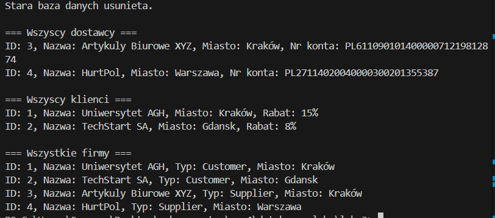
 - Companies, Suppliers and Customers schema
    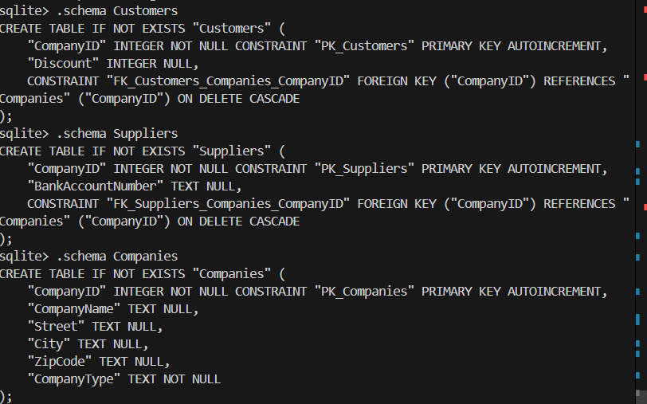
 - Zawartość tabel Companies, Suppliers and Customers
    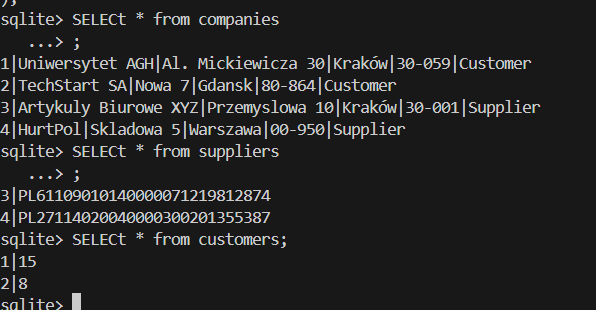
## g)